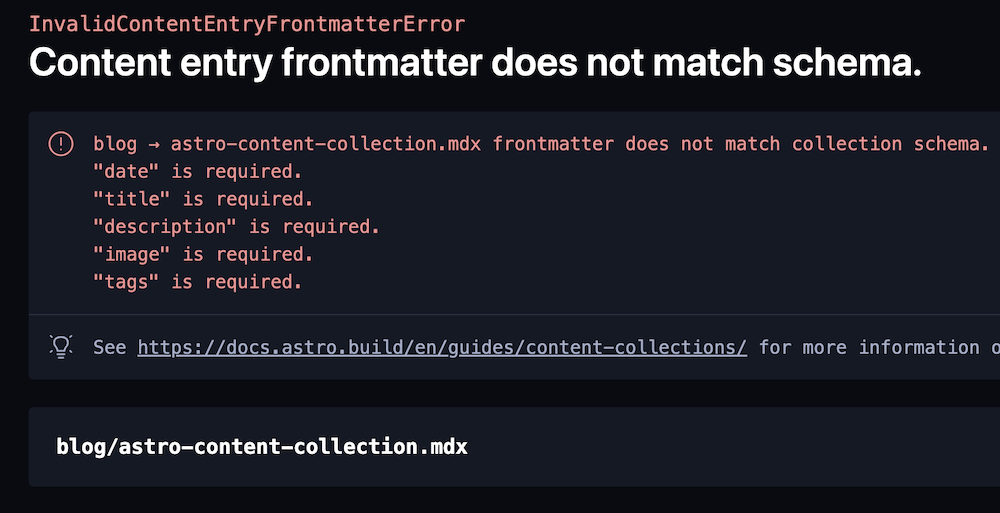

import OG from "../../components/OG.astro";
import TwitterCard from "../../components/TwitterCard.astro";

先日、Astro@2 がリリースされ、多くの機能が追加されました。

- **Content Collections**: `src/content` が予約ディレクトリとなった
  - Markdown/MDX に型が付き、安全になった
- **Hybrid Rendering**: 静的レンダリングと動的レンダリングを複合できるようになった
- エラー画面が読みやすくなった
- Hot Module Reloading (HMR) が改善された
- Vite@4 へ上がった

詳しくは以下の記事を読んでください。今回は、Content Collections について紹介していこうかなと思います。Hybrid Rendering は次回やるかも。

<OG url="https://astro.build/blog/astro-2/" />

---

今回話す Astro@1 の`pages`から`content`への移行の詳しいコードは以下の PR を見てください。

<OG url="https://github.com/hiroppy/site/pull/549" />

## Content Collections とは？

<br />

<OG url="https://docs.astro.build/en/guides/content-collections" />

Markdown/MDX を保存するコンテンツ用の予約されたディレクトリです。その中で以下のように、blog や newsletter などカテゴリーを分けます。

```
src/content/
├── blog
│   ├── astro-client-env.mdx
│   ├── astro-content-collection.mdx
│   └── astro-script-issue.mdx
└── config.ts
```

この Content ディレクトリに置くことにより、frontmatter や Markdown の API の型を強化することができます。

> **1** `pages`にある Markdown/MDX を`src/content/xxx`へ移動させる

## コレクションを定義する

それぞれのカテゴリーのことを Collection と言います。`src/content`の配下に`config.ts`を作成し、[zod](https://github.com/colinhacks/zod)を使い frontmatter を定義する必要があります。

```ts
import { defineCollection, z } from "astro:content";

const blogCollection = defineCollection({
  schema: z.object({
    date: z.date(),
    title: z.string(),
    description: z.string(),
    image: z.string(),
    tags: z.array(z.string()),
  }),
});

export const collections = <const>{
  blog: blogCollection,
};
```

この定義によって frontmatter に対して型検査を行うことができるようになりました。



> **2** `config.ts`を作成し、Markdown/MDX に使われている frontmatter を定義する

### .astro ディレクトリを ignore する

この機能を使うと、config.ts から型が生成されこの`.astro`ディレクトリが作られるため、 git, prettier, eslint に無視するように ignore ファイルに追加します。
またエディタの TypeScript が`astro:content`を import した時に`astro:content module not found`みたいなエラーを出す場合は、以下のコマンドを実行するか TS を再起動しましょう。

```
$ npx astro sync
```

### tsconfig に strictNullChecks を追加する

`null`, `undefined`に強く制限できるようになったため、追加することができます。

> **3** tsconfig に`strictNullChecks`を追加する

## Pages のルーティングにマッチさせる

`content`に置かれたファイルを実際の Path にマッチさせるように変更していきます。今後は、以下の API を使い Content を操作します。

```ts
import {
  defineCollection,
  z,
  getCollection,
  getEntryBySlug,
} from "astro:content";
```

### 一覧ページ

<br />

```astro
---
// src/pages/blog/[...page].astro

import type { GetStaticPathsOptions, Page } from "astro";
import type { CollectionEntry } from "astro:content";
import { getCollection } from "astro:content";
import BlogCardItem from "../../components/BlogCardItem.astro";
import Pagination from "../../components/Pagination.astro";
import MainLayout from "../../layouts/MainLayout.astro";

type Props = {
  page: Page<CollectionEntry<"blog">>;
};

export async function getStaticPaths({ paginate }: GetStaticPathsOptions) {
  // v1: return paginate(await Astro.glob("../pages/blog/*.mdx"), { pageSize: 20 });
  return paginate(await getCollection("blog"), { pageSize: 20 });
}

const { page } = Astro.props;
---

<MainLayout title="Blog">
  <div class="flex flex-col gap-4">
    {
      // v1: page.data.map(({ url, frontmatter }) => (
      page.data.map(
        (
          { data, slug },
          // v1: <BlogCardItem url={url} frontmatter={frontmatter} />
        ) => <BlogCardItem url={`/blog/${slug}`} frontmatter={data} />,
      )
    }
  </div>
  <Pagination prev={page.url.prev} next={page.url.next} />
</MainLayout>
```

上記のコードを見てわかるように、大きくは変わりませんでした。しかし、`Collection`の中に`url`が無くなったため、自分で URL を組み立てる必要があります。
公式でも`/`でつなげてますが、`page.url`には固定した値がなく`/blog`を手に入れる方法がないからです。

> **4** 一覧ページで型/`getCollection`に書き換える

### Content ページの作成

<br />

```astro
---
// src/pages/blog/[slug].astro

import type { CollectionEntry } from "astro:content";
import { getCollection } from "astro:content";

type Props = {
  entry: CollectionEntry<"blog">;
};

export async function getStaticPaths() {
  const blogEntries = await getCollection("blog");

  return blogEntries.map((entry) => ({
    params: { slug: entry.slug },
    props: { entry },
  }));
}

const { entry } = Astro.props;
const { Content } = await entry.render();
---

<Content />
```

今まで、pages に Content を置いていた時には、自動的に URL パスがそのファイル名になって特に何もする必要ありませんでしたが、`src/content`に移動したことによりエントリーポイントを作成する必要があります。
引き続き`layout`の機能は利用できるので、上記のようにルーティングするだけのファイルにすることもできます。

なぜかこのファイルにドキュメント同様の`<h1>{entry.data.title}</h1>`を追加したら文字化けしたので、もしこれに遭遇した時は`render`で生成したもの以外は同じ階層に置かないほうが良いかもしれません。

> **5** `[slug].astro`を作成し、`render`を利用する

## 手順まとめ

<br />

- **1** `pages`にある Markdown/MDX を`src/content/xxx`へ移動させる
- **2** `config.ts`を作成し、Markdown/MDX に使われている frontmatter を定義する
- **3** `tsconfig` に`strictNullChecks`を追加する
- **4** 一覧ページで型/`getCollection`に書き換える
- **5** `[slug].astro`を作成し、`render`を利用し実行する

案外、さっくり終わったので今ブログを構築している方は移行してみても良いかなと思います。

## 既存からの変更まとめ

<br />

- API:コンテンツファイル取得方法の変更
  - `Astro.glob("../pages/blog/*.mdx")` => `getCollection("blog")`
  - `getEntryBySlug('blog', slug)`でファイル単体の取得
- API: `CollectionEntry`の追加
  - `MDXInstance<Frontmatter>` => `CollectionEntry<"blog">`
- API: frontmatter
  - Type: `CollectionEntry<"blog">["data"]`で型を取れるようになり、自前で定義する必要がなくなった
  - `entry.frontmatter` => `entry.data`
  - `frontmatter.url`がなくなり、ひとつ上の階層にある`slug`を使う必要がある
- Performance: render-blocking-resources がアップデートで一つ増えた(-)
