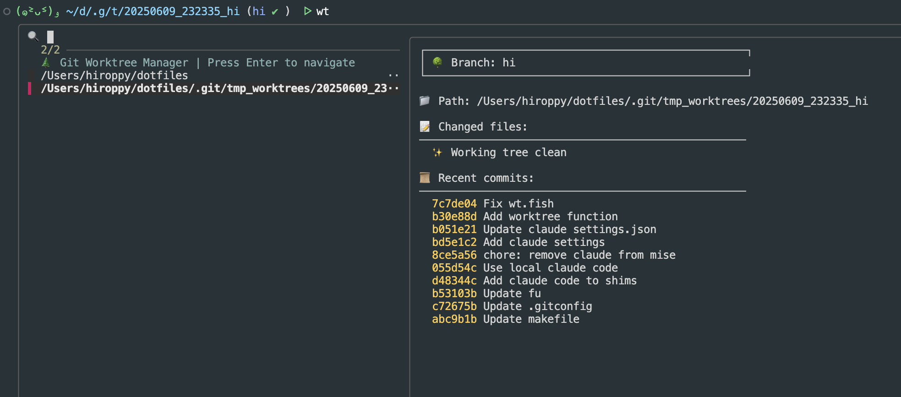

import OG from "../../components/OG.astro";

> このコードはfish専用です。ほかで利用したい場合には、LLMに変換してもらいましょう

<br />

こちらの方の記事を見て、たしかにfzfでworktree間を移動するの楽だなと感じたので、自分用のを書きました。

<OG url="https://sushichan044.hateblo.jp/entry/2025/06/06/003325" />

## この機能が改善させた点

- UI(fzf)でworktreeを選択したら、対象ディレクトリへ移動できる
- ブランチ作成、ディレクトリ作成を一つにまとめる
- worktreeのディレクトリを `.git` 配下に作成し、プロジェク全体でのコミットの対象外にする
  - azuさんに教えてもらいました
- 毎回のセットアップを自動化するために、setup用のhookを追加
- ブランチ削除、ディレクトリ削除を一つにまとめる

特に毎回、`.env`のコピーや`npm i`の実行などセットアップで実行するのがめんどくさいので、hookを一つ用意したのはかなり楽になりました。

## 使い方

```sh
$ wt                      # UIで worktree の一覧を表示し、選択した worktree に移動
$ wt init                 # もしhookファイルが必要であれば、作成する
$ wt add <branch-name>    # 新しいブランチの作成、worktreeの追加、移動
$ wt remove <branch-name> # ブランチの削除、worktreeの削除
```

## 流れ

### hookファイルを作成する(任意)

```sh
$ wt init
$ cat .wt_hook.fish
```

```fish
# .wt_hook.fish - Executed after 'wt add' command in worktree directory
# Available variables:
# - $WT_WORKTREE_PATH: Path to the new worktree (current directory)
# - $WT_BRANCH_NAME: Name of the branch
# - $WT_PROJECT_ROOT: Path to the original project root

# Files and directories to copy from project root to worktree directory
# Add or remove file/directory names as needed
set copy_items ".env" ".claude"

for item in $copy_items
    if test -f "$WT_PROJECT_ROOT/$item"
        # Copy file
        cp "$WT_PROJECT_ROOT/$item" "$item"
        echo "Copied file $item to worktree"
    else if test -d "$WT_PROJECT_ROOT/$item"
        # Copy directory recursively
        cp -r "$WT_PROJECT_ROOT/$item" "$item"
        echo "Copied directory $item to worktree"
    end
end

# Add your custom initialization commands here
# Example: Install dependencies
# npm install
npx corepack enable pnpm
pnpm i
```

### worktreeの作成

```sh
$ wt add hi # ブランチの作成、worktreeの追加、移動が行われる
# 上記のhookがworktree内で実行される
$ pwd
/Users/hiroppy/dotfiles/.git/tmp_worktrees/20250609_232335_hi
$ git branch
* hi
```

### main(master)へ移動する

```sh
$ wt
# 左ペインの一番上を選択
$ pwd
/Users/hiroppy/dotfiles
$ git branch
* master
```



### worktreeの削除

```sh
$ git switch main
$ wt remove hi # ブランチの削除、ディレクトリ(20250609_232335_hi)の削除が行われる
$ pwd
/Users/hiroppy/dotfiles
```

## さいごに

LLMに10分ぐらいで作ってもらったので、もうfish職人じゃなくなりました。

---

functionのコードは以下

<OG url="https://github.com/hiroppy/dotfiles/blob/master/config/fish/functions/wt.fish" />
