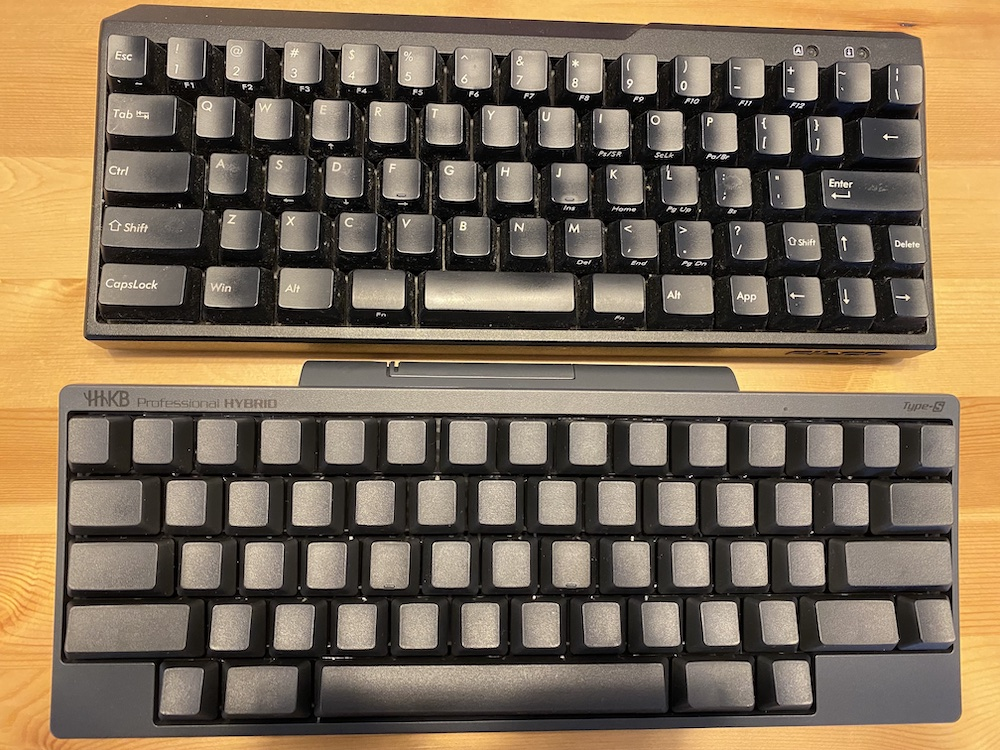
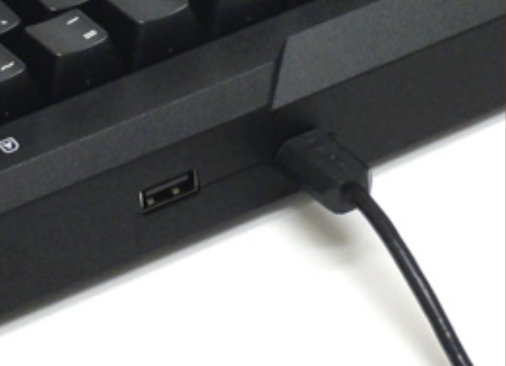
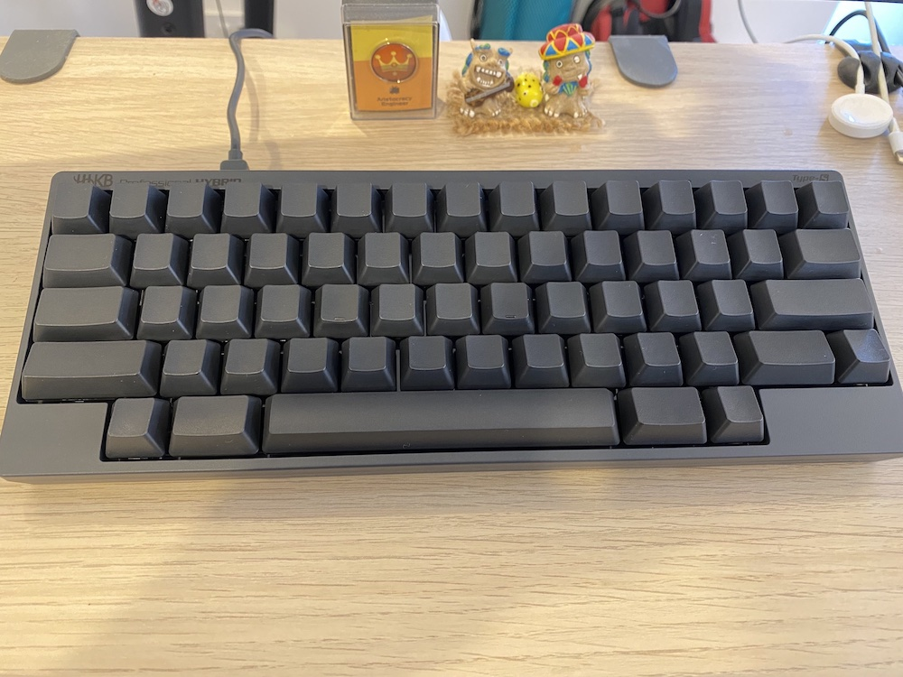

import OG from "../../components/blog/OG.astro";

大学に入ってからずっと使っていた Majestouch をなんとなく辞めて、HHKB に切り替えてみました。
特に大きな不満もなく 12 年間使い続けることができ、今回の乗り換えももう変えてもいいかなぐらいの温度感でした。

今回は、HHKB Professional HYBRID Type-S の墨の無刻印版を購入しました。初 HHKB！

<OG url="https://happyhackingkb.com/jp/products/hybrid_types/" />

半日使ってみた感想をせっかくなので残していきたいと思います。

## 今まで使っていたキーボードについて

Majestouch MINILA というすでに生産が終了しているキーボードを使っていて、その赤軸でした。

<OG url="https://www.diatec.co.jp/products/det.php?prod_c=1319" />

自分としては、赤軸は大変好きな軸ですが、うるさいので自宅でしか使わなかったです。ちなみに会社では REALFORCE の偏荷重を使っていました。

もちろん、大きさも持ち運びにちょうどよかったです。一点問題があるかなと感じたのは bluetooth がないため有線での接続ですが、キーボードの端子が直線なため Mac の上に置くと画面にケーブルがぶつかりキーボードを置けない問題があります。
なので、端子の方向を 90 度変えるアダプターを別途買ってカバーする必要がありました。

## HHKB Professional HYBRID Type-S

無刻印版を買ったのですが、カッコイイですね。。なんかできる感を醸し出せる人になれた気がします。

### 良かった点

- 電池で動く、無線
- 打ちやすい
- 無刻印カッコイイ
- アプリでキーマッピングを細かく記憶させることができる

#### 電池で動く、無線

これは今の時代だと当たり前かもしれませんが、12 年間スタイルを変えてこなかった自分には良かった点でした。。
基本、ディスプレイの USB にキーボードを繋いで不満がなかったので、無線で且つスタンドアロンで動く点に魅力はあまりなかったのですが、たまにリビングのテーブルで作業したい時とかに便利な事に気づきました。
キーボードを PC へ繋がずに Macbook の上に置くだけで済むのが楽だと感じているので、今後更に Macbook のキーボードを使う機会が減りそうです。
また、bluetooth も 4 台登録でき、複数 PC で作業する自分にとってはとても嬉しいです。強いて言えば電池ではなく充電式だともっと嬉しいです。

#### 打ちやすい

静電容量無接点方式を採用しており、自分のサブで使ってたリアフォと同じ打ちやすさがありました。また、赤軸と比べると少し重いかなと感じました。
自分はガチャガチャうるさい系の方が好きですが、オンラインの MTG の時にマイクを付けたまま赤軸を叩くことに対して結構ストレスだったので、これで気を使わなくても良くなりそうです。

#### 無刻印カッコイイ

カッコイイですね、ただ bluetooth ペアリングの時に PC に表示された 6 文字の数字を打ってペアリング完了となるのですが、数字の 7 がどこにあるかとかがわからなくて何回もペアリング失敗しました。
記号よりも数字のほうが自分的には鬼門な気がします、あと普段使わない記号が来たらお手上げです。

#### アプリでキーマッピングを細かく記憶させることができる

*Happy Hacking Keyboard キーマップ変更ツール*が公式から提供されていて、まだ自分はそこまでカスタマイズしてないですが、自分の理想のキーボードにする事ができそうです。
もう少し触って使いづらい部分が見つかったら変えていこうかなと思います。

### 難しい点

- 矢印キーがない

#### 矢印キーがない

買う前に完全に考慮漏れしてた問題で、結構自分にとって、慣れない点でした。エディタのキーバインドが矢印に依存している物もあり、今まで 3 キー(矢印キー込)同時押しで動かせてたものが、右小指で fn を押さないといけなくなり辛いです。手が小さいからかも・・・？

あとは、vim のインサートモードで日本語を書いている時に、一度 IME を英語に戻し、ノーマルモードに戻るのがめんどくさくてインサートで矢印キーを使い移動する癖があるが、それもやりづらい。。
IME の補完や画面の操作スペースの変更、文字移動でも、fn キーの長押しが必要ということが半日たっても慣れないです。

右小指で押さえるという行為に慣れるまで時間がかかりそうですが、これさえ乗り越えてしまえば満足すると思いつつ、4 キー同時押しとかは現実的ではないのでどうにかしないとな。。って考えてます。

## まとめ

まだ半日使い続けただけなので、ちゃんとした評価はできませんが、概ね満足しています。
矢印キーは付いててほしかったと思いつつ、fn の位置を変えたりして、徐々に慣らしていきたいと思います。
おそらくポジション変更しなくても移動できる点が慣れると効率良くなるのかな。。。

