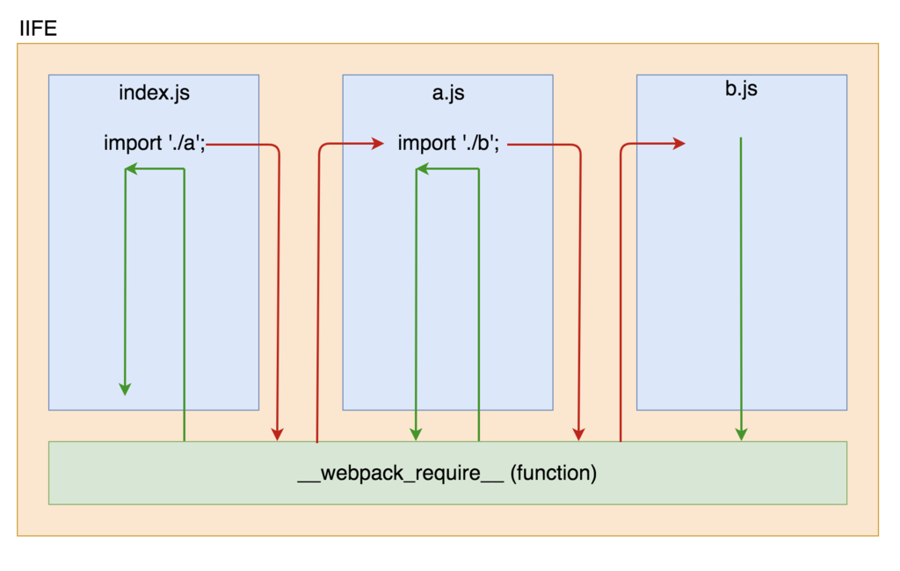
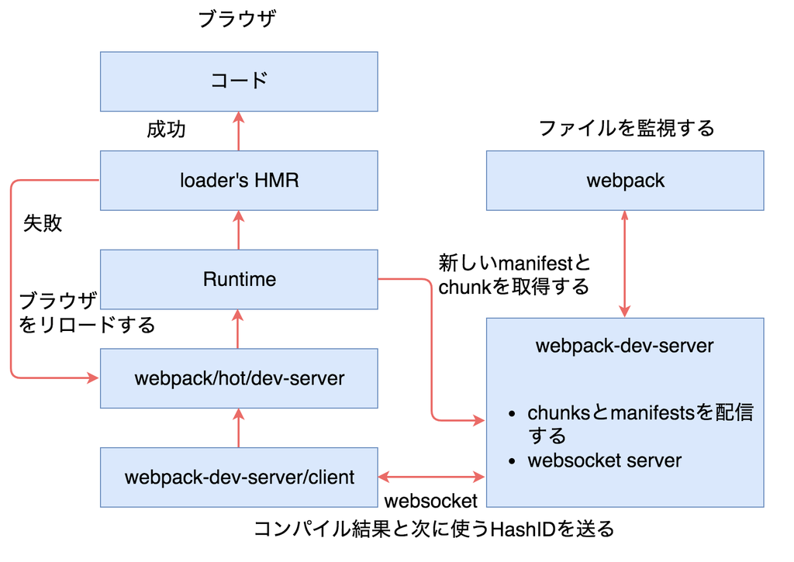
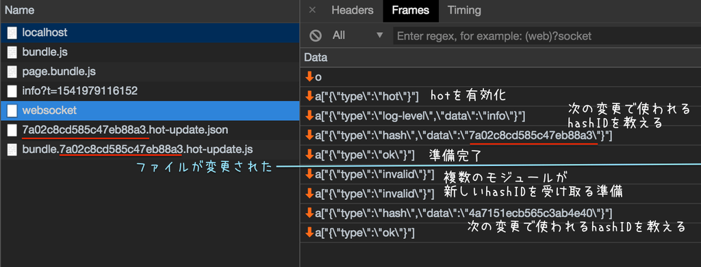
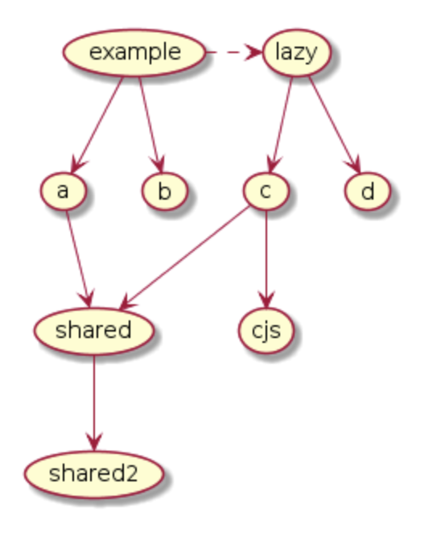
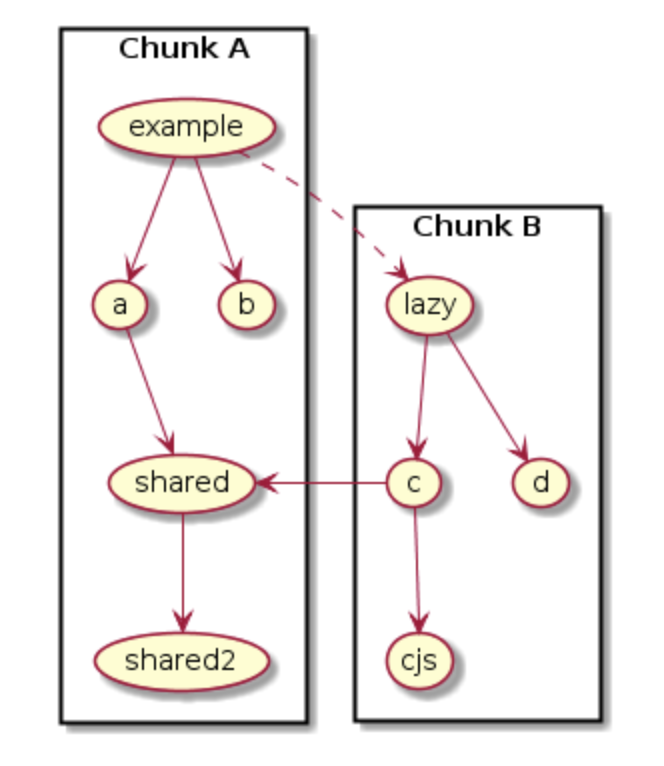
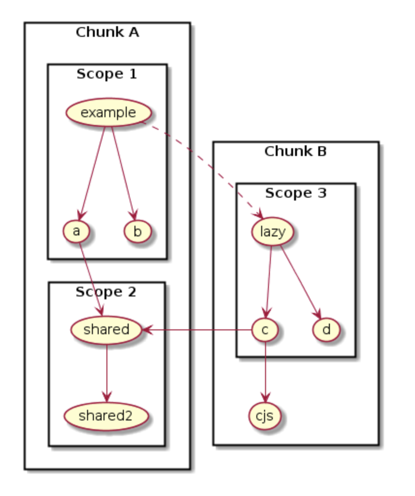

import OG from "../../components/OG.astro";

この記事は、[Node.js Advent Calendar 2018](https://qiita.com/advent-calendar/2018/nodejs)の 18 日目の記事です。

遅れてしまい本当に申し訳ありません。

この記事は、HTML5 カンファレンスで話した内容が中心となります。
Node.js とはかけ離れていますが、自分が書きたかった内容だったので、理解してくださると嬉しいです。

<OG url="https://events.html5j.org/conference/2018/11/session/#a5" />

<br />

<iframe
  width="640"
  height="360"
  src="https://slides.hiroppy.me/webpack-history/"
></iframe>

## モジュール

webpack は以下のモジュールをサポートします。

```javascript
// ESM (ECMAScript Modules)
import foo from "./foo";
export default foo;
import("./foo.wasm"); // native support for WebAssembly
import("./foo.json"); // native support for JSON

// CJS (CommonJS Modules)
const foo = require("./foo");
module.exports = foo;

// AMD (Asynchronous Module Definition)
define(["./foo"], (foo) => foo);
```

```css
@import url("foo.css");
```

```html

```

### モジュールタイプ

webpack は以下のモジュールタイプをサポートします。

モジュールタイプは自動的に`mjs`, `json`, `wasm`に対し選択されます。
他の拡張子は、それにあった loader が必要となります。

- javascript/auto
  - CJS、AMD、ESM のすべてをサポート
- javascript/esm
  - ESM のみをサポートし、`.mjs`のデフォルト
- javascript/dynamic
  - CJS と AMD のみをサポート
- json
  - son をサポート
- webassembly/experimental
  - WebAssembly モジュールのサポート

もし、指定したい場合は、以下のように書きます。

```javascript
{
  test: /\.mjs$/,
  include: /node_modules/,
  type: 'javascript/auto'
}
```

また、現在進行中の作業として、`css`, `url`, `html`があります。

<OG url="https://github.com/webpack/webpack/pull/6448" />

<br />

<OG url="https://github.com/webpack/webpack/pull/6446" />

<br />

<OG url="https://github.com/webpack/webpack/pull/6447" />

### 実行の仕組み

webpack では、`__webpack_require__`という関数を用いて、依存の走査を行います。

少し語弊がありますが、図は以下のような感じになります。



長いので部分的に省略していますが、コードにすると以下のような感じです。

```javascript
(function (modules) {
  var installedModules = {}; // すでに読み込んだモジュールのキャッシュ

  function __webpack_require__(moduleId) {
    if (installedModules[moduleId]) return installedModules[moduleId].exports;

    var module = (installedModules[moduleId] = {
      i: moduleId,
      l: false,
      exports: {},
    });

    // module.exportsをbindし、function(module, exports, __webpack_require__) を実行する
    // moduleのexportsにそのファイルからexportsされた実行結果が入る
    modules[moduleId].call(
      module.exports,
      module,
      module.exports,
      __webpack_require__,
    );
    module.l = true; // 読み込み済みフラグ

    return module.exports;
  }
  return __webpack_require__((__webpack_require__.s = 0)); // entry pointを実行(初回キック)
})({
  0: function (module, exports, __webpack_require__) {
    // 実行コード内の require が __webpack_require__ へ置換される
    // そして、このスコープのために作られた関数の引数にある __webpack_require__ を実行する
    eval(
      'module.exports = __webpack_require__(/*! ./index.js */"./index.js");\n\n\n//# sourceURL=webpack:///multi_./index.js?',
    );
  },
});
```

実行は、IIFE(即時関数)で行われ、引数が各ファイルとなります。
webpack は`entry`が文字列、オブジェクト、配列で受け取れるため引数も文字列、オブジェクト(production ではオブジェクトではなく配列へと変わります)、配列で渡されます。

また`__webpack__require__`は関数ですが、様々なプロパティも保持します。

https://github.com/webpack/webpack/blob/9fe42e7c4027d0a74addaa3352973f6bb6d20689/lib/MainTemplate.js#L40-L54

`module`という変数を経由し、`__webpack__require__`での結果の`export`などが渡ります。

## Hot Module Replacement (v1)

ソースコードが変更されるとブラウザをリロードせずに自動的に変更されたモジュールを新しいモジュールへ置換する機能です。

公式では、以下のライブラリがサポートをしています。

- webpack-dev-server
- webpack-hot-middleware
- webpack-hot-client

webpack がファイル変更を監視し、変更があればコンパイルした js と json を生成し、webpack-dev-server で配信します。

以下のような仕組みになっていて、websocket で会話しつつ、webpack plugin で仕込んだ Runtime と呼ばれる部分で webpack-dev-server で配信された新しいアセットを取得しにいきます。



ここの websocket では、次に Runtime が取りに行く hashID を送ります。
この hashID をファイル名につけて、webpack-dev-server へ fetch を行います。



配信される JavaScript と json の中身は以下のようになります。

```javascript
// "output.hotUpdateChunkFilename": "[id].[hash].hot-update.js"

webpackHotUpdate("bundle",{
/***/ "./a.js":
/*!**************!*\
  !*** ./a.js ***!
  \**************/
/*! no static exports found */
/***/ (function(module, exports, __webpack_require__) {
  eval(...);
/***/ })
})
```

```json
// "output.hotUpdateMainFilename": "[hash].hot-update.json"

{
  "h": "5946277f0fe1b6e0144e",
  "c": { "bundle": true }
}
```

## Tapable (v1)

webpack には、tapable というプラグインシステムを持ちます。
webpack のプラグインを書いたことがある人は、触ったことがあるかもしれません。

例えば、下の例は webpack がクライアントコードのテンプレートを生成するコードです。
`render`というのがコール(`render.call()`)されると以下の`MainTemplate`と呼ばれるタスクが実行される仕組みです。

```javascript
// https://github.com/webpack/webpack/blob/master/lib/MainTemplate.js

this.hooks.render.tap(
  'MainTemplate',
  (bootstrapSource, chunk, hash, moduleTemplate, dependencyTemplates) => {
    const source = new ConcatSource();
    source.add('/******/ (function(modules) { // webpackBootstrap\n');
    ...
    return source;
  }
);
```

また、webpack には以下の多くの hooks を持ち、多彩に様々なことを表現することができます。

<OG url="https://webpack.js.org/api/compiler-hooks/#hooks" />

## Tree Shaking & Dead Code Elimination (v2)

Tree Shaking は別の言い方で、Unused Exports Elimination とも呼ばれます。

- Tree Shaking
  - ESM を使うことにより、未使用のモジュールを検知しバンドル時に分解する
- Dead Code Elimination
  - 実行に影響しない未使用のコードを発見しそれを削除する
  - webpack の場合は、uglifyJS(or terser) が使われる

上記のように、実際は Tree Shaking ではコードが消されないのを注意してください。

### 歴史

案外、Tree Shaking という名前は昔からあり、1990 年代の LISP にさかのぼります。

https://groups.google.com/forum/#!msg/comp.lang.lisp/6zpZsWFFW18/-z_8hHRAIf4J

また、2012 年や 2013 年になると、Google Closure Tools や dart2js でも実装されました。

おそらく、多くの人がこの単語を知ったのは、2015 年の Rollup でしょう。

<OG url="https://medium.com/@Rich_Harris/tree-shaking-versus-dead-code-elimination-d3765df85c80" />

### Tree Shaking

```javascript
// index.js (entry point)
import a from "./a";

console.log(a);

// a.js
import { b1 } from "./b";

const a = `${b1} from b`; // 使われる

export default a;

export const test = () => 2 * 2; // 使われない

// b.js
export const b1 = "b1"; // 使われる
export const b2 = "b2"; // 使われない
const b3 = "b3"; // ローカル変数
```

```javascript
(function (module, __webpack_exports__, __webpack_require__) {
  // index.js (entry point)
  __webpack_require__.r(__webpack_exports__);
  /* harmony import */ var _a__WEBPACK_IMPORTED_MODULE_0__ =
    __webpack_require__(/*! ./a */ "./a.js");

  console.log(_a__WEBPACK_IMPORTED_MODULE_0__[/* default */ "a"]);
});

(function (module, __webpack_exports__, __webpack_require__) {
  // a.js
  /* unused harmony export test */
  /* harmony import */ var _b__WEBPACK_IMPORTED_MODULE_0__ =
    __webpack_require__(/*! ./b */ "./b.js");

  const a = `${_b__WEBPACK_IMPORTED_MODULE_0__[/* b1 */ "a"]} from b`; // b.jsのb1を参照する
  /* harmony default export */ __webpack_exports__["a"] = a; // index.jsのexportsへ'a'キーとして結果を渡す
  const test = () => 2 * 2;
});

(function (module, __webpack_exports__, __webpack_require__) {
  // b.js
  /* harmony export (binding) */ __webpack_require__.d(
    __webpack_exports__,
    "a",
    function () {
      return b1;
    },
  );
  /* unused harmony export b2 */
  const b1 = "b1"; // a.jsによって使われている変数
  const b2 = "b2"; // b2はexportしているが、未使用な変数
  const b3 = "b3"; // b3はexportしていない変数
});
```

`/* unused harmony export xxxx */`というコメントがついていれば成功です。
これはその文の通り、export されているが使ってないことを意味します。

```javascript
/* harmony export (binding) */ __webpack_require__.d(
  __webpack_exports__,
  "a",
  function () {
    return b1;
  },
);
```

そして、`b.js`を見るとわかりますが、使われる変数だけが` __webpack_require__.d`を経由して登録されます。
`b2`は export してますが、`a.js`で使われないため、binding されません。

つまり、このファイルからはこの変数を使っているということをここで表明します。

このように Terser のようなコードを削除するツールにその変数が使われるかどうかを知らせるコードに変形させるのが、tree shaking です。

### Dead Code Elimination

上記の tree shaking されたコードを Terser へかけると以下のようになります。
`b.js`を見ると、`b2`, `b3`という変数がなくなって、`a.js`で使われる`b1`だけが残りました。

```javascript
function(e,t,n){ // index.js (entry point)
  "use strict";
  n.r(t);
  var r=n(/*! ./a */"./a.js");
  console.log(r.a)
}

function(e,t,n){ // a.js
  "use strict"; // testという関数がなくなった
  const r=`${n(/*! ./b */"./b.js").a} from b`;
  t.a=r
}

function(e,t,n){ // b.js
  "use strict";
  n.d(t,"a",function(){return r});
  const r="b1" // b2, b3がなくなった
}
```

これで不要なコードが削除されたことが確認できました！

## Scope Hoisting (v3)

別名、Module Concatenation とも呼ばれます。

ESM を使うことによりインポートチェーンをフラット化し、1 つのインライン関数に変換できる場所を検出します。
つまり、バンドル時に事前に同一階層のスコープを解決する仕組みです。
これにより余分な関数呼び出しを減らし、実行時間・コード量を減らすことを期待できます。

以下の難しいグラフを見てみます。
特に何も書かれていないものは ESM を使っています。



この構造の問題点があります。

- `lazy`, `c`, `d`, `cjs` は example と別チャンクにする必要がある
- `shared`は 2 つの異なるスコープから参照される
- `cjs`は CommonJS module である

これらを単純にチャンク分解すると以下のようになります。



しかし、ESM 同士は静的解析するためビルド時にモジュール解決を行うことができます。
なので、さらにチャンク内で ESM の同レイヤーのスコープ同士をくっつけることが可能です。



つまり、上記のように同一スコープをまとめることが可能です。

- `example` + `a` + `b`
- `shared` + `shared2`
  - この 2 種類は、`lazy`にも使われるため、`example`と一緒にはできない
- `lazy` + `c` + `d`
- `cjs`
  - CJS は静的解析ではない

このようにグループ化することが可能となります。
そして、グループ化したときは、モジュール解決を事前に行うことができ、無駄なコールを減らします。

コード例は以下のとおりです。

この例では、以下が同一スコープとなります。

- `index.js` + `a.js`
- `shared.js` + `shared2.js`
- `lazy.js`

```javascript
// index.js
import a from './a';

(async () => {
  const { default: res } = await import(/* webpackChunkName: 'lazy' */ './lazy');
})();

// a.js
import shared from './shared';      //      +----------+         +----------+
                                    //      |  index   +--------->   lazy   |
const a = `${shared}: a`;           //      +----+-----+         +-----+----+
export default a;                   //           |                     |
                                    //           |                     |
// lazy.js                          //      +----v-----+               |
import shared from './shared';      //      |    a     |               |
                                    //      +----+-----+               |
const res = `${shared}: lazy`;      //           |                     |
export default res;                 //           |                     |
                                    //      +----v-----+               |
// shared.js                        //      |  shared  <---------------+
import shared2 from './shared2';    //      +----+-----+
                                    //           |
export default 'shared';            //           |
                                    //      +----v-----+
// shared2.js                       //      | shared2  |
export default 'shared2';           //      +----------+
```

もし、Scope Hoisting を有効にしなかった場合、以下のように通常展開されます。

```javascript
{ // dist/main.js
/***/ "./a.js":
/***/ (function(module, __webpack_exports__, __webpack_require__) {
/***/ "./index.js":
/***/ (function(module, __webpack_exports__, __webpack_require__) {
/***/ }),
/***/ "./shared.js":
/***/ (function(module, __webpack_exports__, __webpack_require__) {
/***/ }),
/***/ "./shared2.js":
/***/ (function(module, __webpack_exports__, __webpack_require__) {
/***/ })
/******/ };

// lazy.js
(window["webpackJsonp"] = window["webpackJsonp"] || []).push([["lazy"],{
/***/ "./lazy.js":
/***/ (function(module, __webpack_exports__, __webpack_require__) {
/***/ })
}]);
```

このように全ファイルが列挙された状態でのバンドルとなります。
しかし、`index.js` + `a.js`, `shared` + `shared2` は同一スコープであるため、そのスコープ内のモジュール解決の処理は無駄となります。

以下が有効にした場合の例です。
同一スコープになっていることがわかります。

```javascript
{
/***/ "./index.js":   // index.js + a.js
/*!******************************!*\
  !*** ./index.js + 1 modules ***!
  \******************************/
/*! no exports provided */
/*! all exports used */
/*! ModuleConcatenation bailout: Cannot concat with ./shared.js because of ./lazy.js */
/***/ (function(module, __webpack_exports__, __webpack_require__) {
/***/ }),

/***/ "./shared.js": // shared.js + shared2.js
/*!*******************************!*\
  !*** ./shared.js + 1 modules ***!
  \*******************************/
/*! exports provided: default */
/*! exports used: default */
/***/ (function(module, __webpack_exports__, __webpack_require__) {
  // CONCATENATED MODULE: ./shared2.js
  /* harmony default export */
  var shared2 = ('shared2'); // すでにここでモジュール解決を行っている
  // CONCATENATED MODULE: ./shared.js
  /* harmony default export */ var shared = __webpack_exports__["a"] = ('shared');
  //# sourceURL=webpack:///./shared.js_+_1_modules?");
/***/ })
/******/ };


// lazy.js
(window["webpackJsonp"] = window["webpackJsonp"] || []).push([["lazy"],{
/***/ "./lazy.js":
/***/ (function(module, __webpack_exports__, __webpack_require__) {
/***/ })
}]);
```

ソースコード内のコメントに、`!*** ./index.js + 1 modules ***!`とあります。
これが、Scope Hoisting でバンドル時に同一スコープを先に解決し、同じファイルに結果がまとめられたということがわかります。
この時すでに`__webpack__require__`を経由せずに値の解決をバンドルされた JS 内で行われているため、無駄な走査を省くことができます。

<OG url="https://github.com/webpack/webpack/tree/master/examples/scope-hoisting" />

## SplitChunksPlugin (v4)

`CommonsChunkPlugin`が廃止され、新しく追加されたプラグインです。

廃止された理由は以下のようになります。

- 表現力が低く、非同期チャンクにそのときに不必要な無駄なものが入り、必要以上のダウンロードが発生する可能性がある
- 制御構文が難しい(e.g. `minChunks`)

例えば、`node_modules`を bundle.js として生成するがそのページで必要なものは実際その全てではないということが今までで経験したことと思います。

SplitChunksPlugin では、モジュールの重複回数とモジュールのカテゴリー(e.g. node_modules)により、
自動的にチャンクとして分割するべきモジュールを識別し、分割します。

以下の点が`CommonsChunkPlugin`との大きな違いです。

- 不要なモジュールをダウンロードしないため、非同期チャンクでも効率的
- 扱いが簡単で自動的
- チャンクグラフを弄らなくて良い

以下の例を見てもらうとわかりやすいです。
左側が生成されたチャンクで、右側が SplitChunksPlugin を実行した結果です。

[f:id:about_hiroppy:20181225220618p:plain]

各チャンクすべての共通箇所をまとめて、最小単位の共通チャンクに再分解しているのがわかります。
デフォルトでは、ファイル名は`~`でつながり、中身で使われているコードの元ファイル名が連結されます。
このように分けることにより、必要なときに必要なファイルをダウンロードすることができます。
これは、パフォーマンスチューニングにおいて大切な要素です。

また、まとめられた各チャンクの最大・最小ファイルサイズも指定することができるようになりました。

```javascript
module.exports = {
  splitChunks: {
    minSize: 100000, // bytes
    maxSize: 1000000, // bytes
    cacheGroups: {
      vendor: {
        test: /node_modules/,
        name: "vendor",
        chunks: "initial",
        enforce: true,
      },
    },
  },
};
```

```
vendor.e01916c600d5e12dd9aa.16.bundle.js   1.41 MiB

↓

vendor~253ae210.e46c3fe01b7780f11d81.bundle.js    316 KiB
vendor~7274e1de.a2d5e8d87c5e36752b28.bundle.js    183 KiB
vendor~7d359b94.79f7863fa304fe20067e.bundle.js   53.5 KiB
vendor~9c5b28f6.71223a4ff0625388be27.bundle.js    610 KiB
vendor~b5906859.2b626aa82671c8667e3a.bundle.js   95.2 KiB
vendor~db300d2f.d22d5b79be58987d729e.bundle.js   92.9 KiB
vendor~ec8c427e.59a4800bc2621be8d855.bundle.js     95 KiB
```

このように分けれる範囲で分解をすることも可能です。

---

webpack では、まだまだ様々なアルゴリズムが存在します。
また、今回の説明で出したものは、v4 の`production`モードを有効にすると最適化はすべて行えます。

現在、v5.0.0-alpha.1 も出ているので、そちらも楽しんでみてください！

<OG url="https://github.com/webpack/changelog-v5/blob/master/README.md" />

もしなにかありましたら、[twitter](https://twitter.com/about_hiroppy)までどうぞ！
