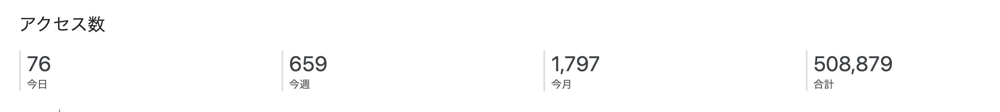

import OG from "../../components/OG.astro";

タイトルの通りこの hiroppy.me のサイトを 1 から刷新し、そこにブログページが入ったことによりブログもはてなから移管することにしました。

特に意識してなかったのですが、はてな ブログの方が、ちょうど [100 記事目](https://abouthiroppy.hatenablog.jp/about)の時に移行するという流れになってしまいました。。
はてな ブログは有料会員で 4 年間ぐらいやっていたのですが、最近は使えておらず、そうなると当初の目的である独自ドメインでのはてブ通知も今はあまり必要なくなりました。
また、ブログの名前が**技術探し**ですが、最近はプライベートの話や技術を昔以上に探せてない点があり、もう自分としては役割を終えたのかなと思っています。

359 人の方に購読してもらい、多くの方に閲覧してもらって本当にありがとうございました。1 年半も技術の記事を投稿していなかったのに未だにアクセスがあり、嬉しく思います。



過去の記事もこちらへ移動させてますが、50 記事分を移動させたところで力尽きたので半年ぐらいかけて古いのも徐々に移動させようかなと思います。

ちなみにはてなの前は ghost を使って今と同じようにブログを自前で構築していました。

<OG url="https://ghost.org/" />

それでは、ここからは技術的な話

## Gatsby から Astro へ

前のサイトは Gatsby で書かれていて、今回のサイトは Astro で構築されました。**JS がない軽量なサイト(3rd 除く)** で **素の HTML に近い状態のコード**を持っておきたかったのが理由です。
それに伴って CSS も以前は styled-components を利用していましたが、今回は Tailwind にしました。
剥がしやすさって面だと自分はその時になったらまた 0 から書くだろうしあまり気にしてませんが、CSS in JS よりは剥がしやすいかなと思います。

今回の主な依存は以下のみとなり、基本 Astro のリポジトリを見ておけばどうにかなるのかなと思っています。

- Astro
  - Tailwind
  - image (Sqoosh, Sharp)
  - Partytown
  - mdx (Remark)

### 設定が少なく快適

画像の最適化やるにも sitemap 作るにも partytown の設置をするにも 1 行、`integrations`に追加するだけで動きます。
Gatsby は書く設定が多く、それによりアップデートに追いつけなくなる事象が過去にあったのでこれは自分にとって必要な要素でした。

Next.js ももちろん楽ですが、React に依存したくなかったり、仕事で常に使っているので今回は対象外です。あとは、Next@13 で App Directory が`next export`に今現在、非対応ってのもあり選択肢から外されています。

### やはり Markdown で記事を作るのは難しい

Astro に限らずの話ですが、素の Markdown でブログを作るのは無理だと思っていて、例えば OG の展開はみんなどうやっているんでしょう。。
このサイトでは MDX を使って OG 用のコンポーネントを用意し、そこで展開しています。Twitter や Youtube は`iframe`で良いのですが、これだけが悩みどころ。

もう一つの方法としては、remark で AST をいじって挿入する感じですが、これは Markdown にどう展開するかの識別子を用意(はてなみたいに `()[foo.com:title]`みたいな)しないといけなかったりして大変なので MDX が良い落ちどころとなりました。

### ビルドの時間を削減するためにキャッシュを作る

Astro は基本、ビルド時に全部のページを実行するため、そこに`fetch`を入れすぎると簡単にビルド時間が遅くなります。このサイトのビルドだとキャッシュを作っておかないと 1 分近くかかってしまいます。

あり

```sh
Executed in   10.74 secs    fish           external
   usr time   16.19 secs   60.00 micros   16.19 secs
   sys time    1.44 secs  665.00 micros    1.44 secs
```

なし

```sh
Executed in   57.60 secs    fish           external
   usr time   28.07 secs    0.07 millis   28.07 secs
   sys time    2.66 secs    1.14 millis    2.66 secs
```

もちろんこれも Astro 特有の対応というわけではないですが、例えば上で話した OG を展開するコンポーネントは以下のような処理を入れてキャッシュを作ります。

```ts
const { url } = Astro.props;
const path = new URL("../../generated/ogp.json", import.meta.url);
const ogp: OGPJson = JSON.parse(readFileSync(path, "utf8"));

if (ogp[url]) {
  title = ogp[url].title;
  description = ogp[url].description;
  image = ogp[url].image;
} else {
  const html = await fetch(url).then((res) => res.text());
  const $ = load(html);
  const ogp = JSON.parse(readFileSync(path, "utf8"));

  writeFileSync(
    path,
    JSON.stringify({
      ...ogp,
      [url]: {
        title:
          $("meta[property='og:title']").attr("content") ?? $("title").text(),
        description: $("meta[property='og:description']").attr("content") ?? "",
        image: $("meta[property='og:image']").attr("content") ?? "",
      },
    }),
  );
}
```

`JSON.xxx`を使ったり `sync` を使ってイベントループ的には良くないですが、ビルド時しか実行しないので問題ないかなと思います。
また、一気に色々なところから呼ばれるため`promise`を使うと書き込みが冪等にならず、タイミングによっては json が壊れてしまうので、`sync`を使う必要があります。

このサイトを構築するキャッシュはすべて[ここ](https://github.com/hiroppy/site/tree/main/generated)に置いてあります。

## Netlify から Vercel へ

これは Vercel に東京リージョンが存在するからという理由で移行しました。最初引き続き Netlify を使っていましたが、体感でわかるぐらいには遅いのがわかりました。
Vercel への移行はかなり簡単でしたが、`Cache-control`が全てに対して `public, max-age=0, must-revalidate`なので、ちゃんとした設計にするには vercel.json で assets などを適した値へ変更させる必要があるなと思いました。
(使われているフレームワークを vercel 側で判断しているので自動でこれやってほしいと思ったり。。)

## CI

久しぶりに Gatsby を触ったら動かなくなってて、今回の作業をやったのが理由でもありますが、自分としてはリポジトリは基本的に放置したいと考えています。
しかし、npm の deps のアップデートは依存している量が少なくても頻繁に発生しがちです。 Renovate の auto merge に任せたいんだけど、壊れているのに気づかない可能性があります。
なので、型チェックに加え申し訳程度の CI を追加しておき、少しだけの安心を得るようにしておきました。

### Visual Regression Testing

最新の UI のスクリーンショットを現在と比較し diff があるかテストする手法で、一番、変更によって壊れたかどうかを判断してくれる CI です。
今回は Playwright を使って、主要画面のスクリーンショットを比較します。
テスト自体は、以下のように簡単でこれだけで diff とかもレポートしてくれます。

```typescript
for (const path of paths) {
  test(`VRT: ${path}`, async ({ page }) => {
    await page.goto(`http://localhost:3000${path}`);
    await expect(page).toHaveScreenshot({
      fullPage: true,
      scale: "device",
    });
  });
}
```

しかしながら、問題はフォントです。OS 間でフォントは異なるので Playwright はスクリーンショットを OS 毎に区別します。
メインの PC が Mac なので Actions の方も Mac にしようかと思ったけど、Win からコミットされるときのことや Actions の Mac のパフォーマンスが悪かったりするので ローカルは docker 上の Ubuntu で生成することにしました。

```sh
$ docker run --rm --network host -v $(pwd):/work/ -w /work/ -it mcr.microsoft.com/playwright:v1.28.0-focal /bin/bash -c 'npm test -- -u'
```

### Lighthouse

パフォーマンスを測ったりベスプラから逸れている場合に警告してくれる CI です。
公式が提供している Actions にトークンを渡すだけで検査してくれます。閾値が厳しい可能性があるので調整は必要かなと思います。

CI が完了すると、このようにレポートを通知してくれます。

<OG url="https://storage.googleapis.com/lighthouse-infrastructure.appspot.com/reports/1668817257600-29285.report.html" />

### Pa11y

<br />

<OG url="https://github.com/pa11y/pa11y" />

Web Content Accessibility Guidelines (WCAG) をベースに HTML のアクセシビリティを検査します。AA がデフォルトですが、A と AAA にも対応されています。
Level2 までの最低限のアクセシビリティを担保するために導入されています。

<OG url="https://www.w3.org/WAI/WCAG2AA-Conformance" />

## URL 移管

サブドメインよりもサブディレクトリの方が SEO 的にはそのドメイン自体の評価が上がります。
なので、blog.hiroppy.me を捨て、hiroppy.me/blog へ変更させます。

しかしながら今回、blog.hiroppy.me から hiroppy.me/blog へ移動させるのは大変でした。
通常であれば、サーバーで 301 を返すだけで良いのですが、サーバーは はてな が管理しているのでそれは手を加えなければできません。
他の方法としては、以下のように 記事上の JS のレイヤーでリダイレクトを行う方法があります。

```html
<script type="text/javascript">
  const url = "https://new-site";
  const head = document.querySelector("head");

  {
    const link = document.querySelector("link[rel='canonical']");

    link.setAttribute("href", url);
  }

  {
    const meta = document.createElement("meta");

    meta.setAttribute("name", "robots");
    meta.setAttribute("content", "noindex");
    head.appendChild(meta);
  }

  {
    const meta = document.createElement("meta");

    meta.setAttribute("http-equiv", "refresh");
    meta.setAttribute("content", `0 URL=${url}`);
    head.appendChild(meta);
  }
</script>
```

`<meta http-equiv="refresh" content="0 URL=xxx">` でリダイレクトさせます。
同じ記事が重複するとコピーと判定されてしまう可能性があるため`noindex`をつけ、`canonical`で新しいブログの記事を指定することにより 301 と似たような処理を行えます。

ただ、これ入れてみて思ったんですが、一度 はてな の画面が出て自分のブログに飛ぶ体験が最悪なんですよね。。
これは最終手段で本来はもっと前段でハンドリングするべきなので、別の方法を考えました。

### Google Domain の転送オプション

Google Domain には標準でパスを引き回しつつリダイレクトをかける事ができます。

<OG url="https://support.google.com/domains/answer/4522141?hl=ja" />

しかしながら、はてな のパスは `/entry/:id` となっていて、新しいパスは `/blog/:id` なのでそのままパスを引き回せずこの機能は使えません。

### Firebase Hosting で redirects

最終的にはこの方法で解決しました。Firebase である必要はなく、ただ慣れてたので今回は Firebase を選択しました。この方法だと、コードを書かず json で管理するだけで良くなるので楽かなと思います。

blog.hiroppy.me の向き先を Firebase hosting へ変更し、`redirects`に追加するだけです。

```json
{
  "hosting": {
    "public": "public",
    "ignore": ["firebase.json", "**/.*", "**/node_modules/**"],
    "redirects": [
      {
        "source": "/entry/:page",
        "destination": "https://hiroppy.me/blog/:page",
        "type": 301
      }
    ]
  }
}
```

しかしこれで解決かと思いきや、一番苦労したのが、自分の怠惰によって多くの記事に custom path を指定してなかった結果、URL がデフォルトの`/`区切りの日付になっていました。
e.g. `entry/2017/08/08/192320`

これ普通にディレクトリなので URL をディレクトリ構造で表現する Astro だと正直やりたくないんですよね。。
ただ、はてな に置いてある記事の Path を変えると引用されている場合のリンク切れが発生するので、変更はしたくなく、結局この`redirects`の中に大量のリダイレクトを列挙することになりました。。。

これが終わったら、過去のブログの記事全てに `noindex`と`canonical`をつける作業を行い全ての以降が終わりとなります。

## さいごに

無事、新しいサイト・ブログの方に移動できました。今までのはてなブログの URL であるhttps://blog.hiroppy.me はリンク切れを起こさず、新しいこちらのブログへ誘導されます。

主に URL の変更する場合は、めんどくさいことが多いなって印象があったので参考になればと思います。

- Astro と心中します
- 次の負債は mdx になりそうだけど、もうできたらブログ移管はしたくない
- JS で 301 を再現するのは体験が悪いのでやめるべき
- **必ず記事には custom path を設定しましょう**

それでは、今後ともこのブログをよろしくおねがいします。
