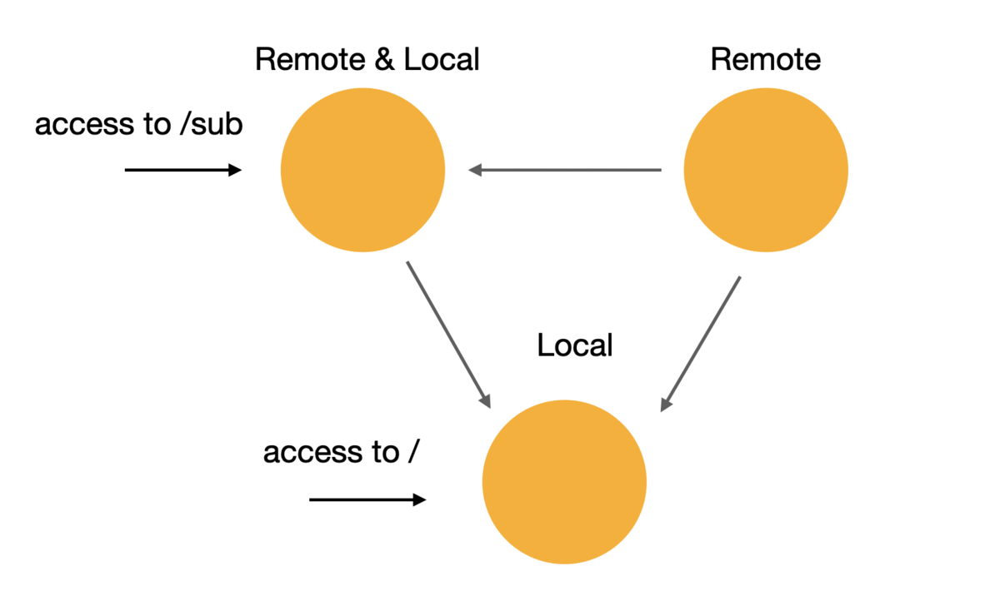
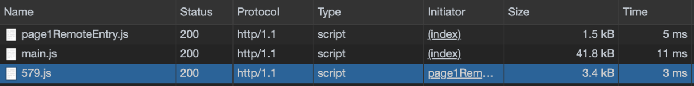
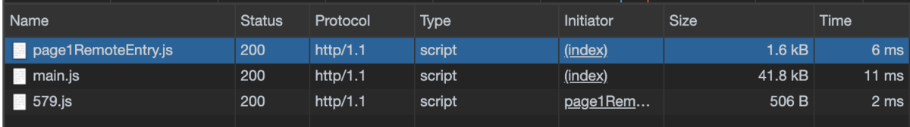
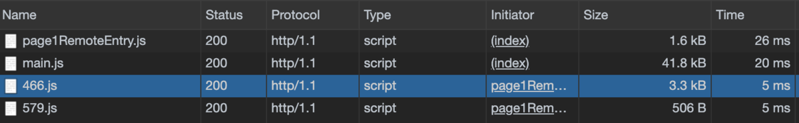

import OG from "../../components/blog/OG.astro";
import TwitterCard from "../../components/blog/TwitterCard.astro";

Module Federation(以下 mfe)は webpack@5 から入る新しい仕組みの一つです。

## Proposal

<OG url="https://github.com/webpack/webpack/issues/10352" />

## 目的

アプリケーションを作る時に、webpack はビルド時のソースコードは使う前提で実行するので、様々な最適化を行うことができます。
もし、node_modules 経由以外でライブラリを使うという場合は script タグや ESM から取得するというのが一般的です。

https://whatwg.github.io/loader/#browser-loader-prototype-@@resolve

しかし、この場合だと問題点が出てきます。それはライブラリの重複問題です。
取得するライブラリはすでに bundle 済みなため、その中には同じライブラリが存在することが多いです。
ユーザーは重複するライブラリ(e.g. react, react-dom, etc.)の取得を行う可能性が高いため、その最適化を行うのが Module Federation です。


上記の図だと、main.js で使っている緑のライブラリは lib-a でも lib-b でも使っていて、それを 3 つダウンロードするのは無駄なので main.js がダウンロードしている緑に lib-a/b が依存すればネットワークの最適化ができます。

DLLPlugin や`externals`でも同様のことはできますがそれらは貧弱なので今後はこちらに乗り換えることが可能なケースがあります。

この記事では内部は深く触れないため、内部アルゴリズムが知りたい人はこちら

<OG url="https://github.com/webpack/changelog-v5/blob/master/guides/module-federation.md#low-level-concepts" />

コード: [containers](https://github.com/webpack/webpack/tree/dev-1/lib/container)

この仕組みは Micro Frontends のためだけにあるわけではありませんが、 一番機能する可能性が高いとは思います。

Micro Frontends とはなにか？

<OG url="https://micro-frontends.org" />

## 用語

- ローカル(モジュール) => 使う側
  - ビルドラインに入っている通常モジュール
- リモート(モジュール) => 使われる側
  - 実行時にコンテナーから呼び出されるモジュール
- コンテナ => ローカル、リモートにそれぞれいるマネージャー
  - モジュールの前段にいるもの、実際にはリモートの URL ではなくリモートのコンテナ URL って言ったほうが正しい
  - ここでモジュールの公開をするかどうかを制御する
  - コンテナ間での循環的な依存が可能で、このコンテナが上書き API(`__webpack_override__`)を提供する
    - 兄弟関係でのみ上書きは可能で、単一方向の操作
  - コンテナは以下の処理を行います
    - 非同期チャンクの読み込み
    - そのチャンクの評価

## 注意

リモートモジュールは、非同期チャンクとなりチャンクロードの処理が必要なため基本的には、`import()`が使われますが、`require()`や`require.ensure()`にも使用可能です。
top-level での import もビルドはできますが、同期チャンクとなってしまうため実行時にはエラーとなります。
**つまり、この仕組みは bundle 時にまだ不明なプログラムを許容するため、実行時に初めてエラーがわかります。 **

そして、ローカルもリモートになることが可能なため、各チャンクは立ち位置がその場の状況によって変化します。
ローカルと決めてたチャンクに exposes を設定すればそれがリモートチャンクとなるということです。



この場合だと、左のノードがその例で、`/sub`へアクセスした場合は Local という扱いになりますが、`/`へアクセスすると左のノードはリモートという扱いになります。(下のノードから見てリモート)

## 設定とコード

先にコードを見ていきましょう。この構成では、リモートのファイルをローカルが取るシンプルな例です。

<OG url="https://github.com/hiroppy/webpack-mfe-sample" />

### リモート

```javascript
// webpack.config.js
const { ModuleFederationPlugin } = require("webpack").container;

module.exports = {
  output: {
    // このリモートのファイルがローカルで展開されるときにpublicPathを書かないと親の実行時に親のURLを見てしまうので必須
    // このPRで変更される: https://github.com/webpack/webpack/pull/10703
    publicPath: "http://localhost:8081/",
  },
  plugins: [
    new ModuleFederationPlugin({
      name: "page1", // エントリーの名前、exposesがある場合は必須キー
      library: {
        type: "var", // scriptタグを経由する、他のオプションはこちら https://github.com/webpack/webpack/blob/dev-1/schemas/plugins/container/ModuleFederationPlugin.json#L155
        name: "page1", // importされるときの名前(この場合は、import('page1/xxxx'))
      },
      filename: "page1RemoteEntry.js", // 出力されるentryのファイル名
      exposes: {
        Page: "./src/index.js", // コンポーネント名(この場合は、import('page1/Page'))
      },
    }),
  ],
};
```

<br />
```javascript // src/index.js import React from "react";

const Page1 = () => <h1>This is Page1</h1>;

export default Page1; // React.lazyはdefault exportsのみ許容
```
<br />
```
              Asset       Size
             579.js   7.27 KiB  [emitted]
 579.js.LICENSE.txt  295 bytes  [emitted]
            main.js   7.68 KiB  [emitted]            [name: main]
main.js.LICENSE.txt  295 bytes  [compared for emit]
page1RemoteEntry.js   2.09 KiB  [emitted]            [name: page1]
```

### ローカル

```javascript
// webpack.config.js
const { ModuleFederationPlugin } = require("webpack").container;
const HtmlWebpackPlugin = require("html-webpack-plugin");

module.exports = {
  plugins: [
    new HtmlWebpackPlugin({
      template: "./index.html",
    }),
    new ModuleFederationPlugin({
      remotes: {
        page1: "page1", // page1をローカル側で使用することを伝える、import('page1/xxx')
      },
    }),
  ],
};
```

<br />
```javascript // src/index.js import React, {(lazy, Suspense)} from "react";
import {render} from "react-dom";

// page1/page(remote)をdynamic import
const Page1 = lazy(() => import("page1/Page"));

const Wrapper = () => (

<div>
  <Suspense fallback={<span>Loading...</span>}>
    <Page1 />
  </Suspense>
</div>
);

render(<Wrapper />, document.getElementById("root"));

````
<br />
```html
<!-- index.html -->
<!doctype html>
<html>
  <head>
    <meta charset="utf-8" />
  </head>
  <body>
    <div id="root"></div>
    <!-- import('page1/page'))で読み込むためにremoteのファイルを取得 -->
    <script src="http://localhost:8081/page1RemoteEntry.js"></script>
  </body>
</html>
````

<br />
``` Asset Size index.html 194 bytes [compared for emit] main.js 128 KiB
[emitted] [name: main] main.js.LICENSE.txt 790 bytes [compared for emit] ```

このように、`import('<scope>/<request>')`という形でローカル側は取り込みます。

## 依存関係共有

`shared`というオプションをつけることにより、依存関係の共有を行い、**リモートはローカルの依存関係を優先的に参照します。**
**もしローカルに依存関係がない場合、リモートは独自にダウンロードを行います。**
この仕組みにより、バンドルを跨いだ関係でも最小限にファイル量を留めることができます。

上記のコードでは、このオプションを入れる前の Network は以下のようになります。



579.js というリモートの JS に注目してください。このファイルは page1RemoteEntry.js から呼び出されます。
この 579.js に React のライブラリソースコードが入っています。(main.js の中にも同様のコードが入っている)

では、ローカルもリモートも React を使っているので、両者の webpack.config.js に以下を追加します。

```javascript
new ModuleFederationPlugin({
  // ...
  shared: ["react"],
});
```

そうすると、以下のように 579.js のサイズが 3.4kb から 506b まで下がりました。
これは、React ライブラリのソースコードがなくなり、579.js が main.js に含まれている React のライブラリコードを参照しているという状態です。
この 579.js に残っているコードは`const Page1 = () => <h1>This is Page1</h1>;`のみとなります。



では、リモート側には`shared: ['react']`を付け、ローカル側をなくすとどうなるでしょう？
最初に説明したとおり、ローカル側が`shared`を設定してなかった場合は、リモート側が自身の URL から React ライブラリをダウンロードするようにフォールバックが行われます。



この 466.js が React のライブラリコードとなります。
これらはコンテナである page1RemoteEntry.js が管理していて、リモートに同一のライブラリがないのでこのコンテナが 466.js をダウンロードする処理を行います。

まとめると、リモートは共有されるであろうライブラリは`shared`に入れておいた方が管理が楽だと思います。 そうすると使う側がそれを許容するかどうかを管理できるためです。

## Q&A

Q: URL は HTML に書く必要あるの？
A: html-webpack-plugin の対応を待つか webpack で container の url が引けるためそれを html にわたす実装を書く

Q: 共有ライブラリのバージョンが異なる場合どうすればいいの？
A: 標準ではないが、以下のような書き方はできる。

```json
{
  "shared": {
    "react@6": "react"
  }
}
```

Q: ハッシュ付きファイル名の場合どうすればいいの？
A: webpack 間でのオーケストレーションを維持するためハッシュ付きファイル名は出力されません

Q: ローカルとリモートで共通ライブラリを管理するのだるい
A: 今後自動的に入れる仕組みが入ると思う。3rd party ではすでに存在するらしい。ただ手で書いたほうがいい気はする

Q: IDE での補完が効きません。
A: わかります、けどこれ webpack.config.js を IDE が理解できるようにならないと解決しない

Q: SSR でも動くか？
A: 設計上、web に限定して作ってないので動く。`library.type`を`var`から`commonjs-module`に変えてみて。

## さいごに

ユーザーはこの shared さえ知っていればよくて containers とかは基本的には知らなくていいです。
まだ安定的なフェーズではなく実験的なのでインターフェイスの変更には注意してください。
なにか聞きたいことあれば、[twitter](https://twitter.com/about_hiroppy)まで。
