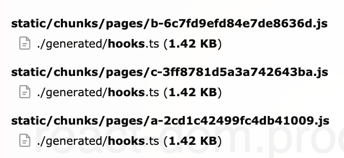
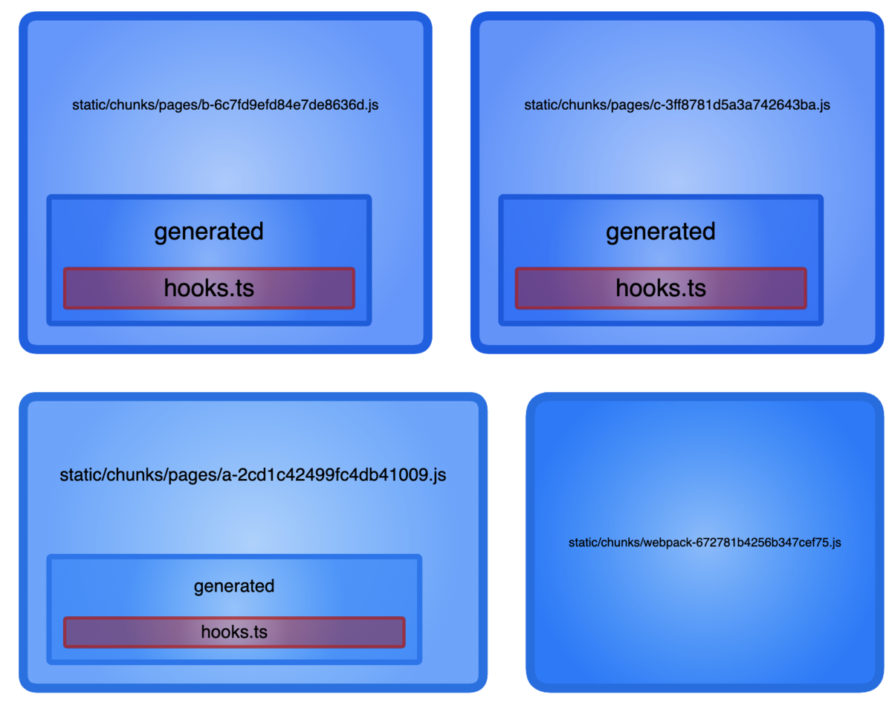
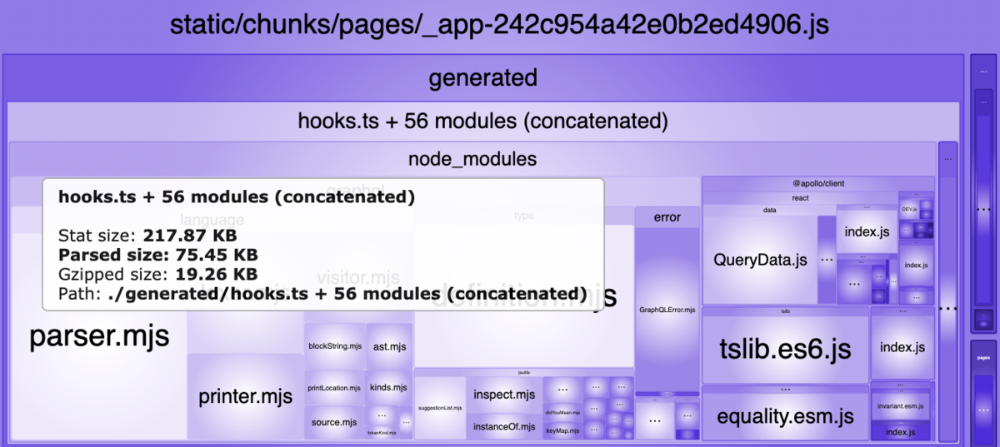
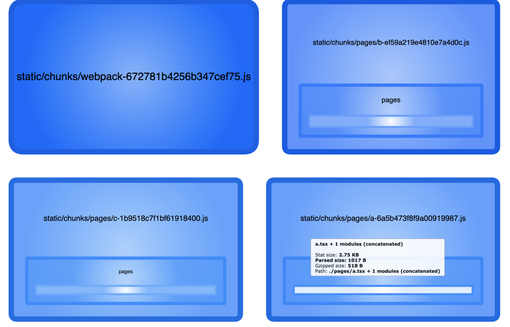

import OG from "../../components/blog/OG.astro";

今回は graphql-codegen を使い説明します。今回の例は、graphql-codegen 以外でも発生する可能性がありますが自動生成系が一番顕著に影響がわかりやすいです。

graphql-codegen はよく、graphql のスキーマから typescript の型定義/react の hooks 等を自動生成するのに使われますが、これは next.js と組み合わせた場合、少しトリッキーな部分があります。

<OG url="https://www.graphql-code-generator.com" />

graphql-codegen はデフォルトでは 1 ファイルにすべて出力されますが、それに対し next.js は各ページを chunks として吐くため何も考えずに実装すると、バンドルされるファイル量が膨大になる可能性があります。next.config.js から webpack の設定を上書きできますが、optimization はかなり上書きしづらくそもそも上書きは基本避けるべきなのでその手法は取るべきではないです。

例えば、`A`, `B`, `C` query を例に以下を見てみましょう。

```typescript
// generated/hooks.ts <- codegenによって作られたファイル
import { gql } from "@apollo/client";
import * as Apollo from "@apollo/client";

export const ADocument = gql`
  query A {
    hero(episode: "JEDI") {
      name
    }
    droid(id: "2000") {
      name
    }
  }
`;

export function useAQuery(
  baseOptions?: Apollo.QueryHookOptions<AQuery, AQueryVariables>,
) {
  const options = { ...defaultOptions, ...baseOptions };
  return Apollo.useQuery<AQuery, AQueryVariables>(ADocument, options);
}
export function useALazyQuery(
  baseOptions?: Apollo.LazyQueryHookOptions<AQuery, AQueryVariables>,
) {
  const options = { ...defaultOptions, ...baseOptions };
  return Apollo.useLazyQuery<AQuery, AQueryVariables>(ADocument, options);
}
export const BDocument = gql`
  query B {
    hero(episode: "JEDI") {
      name
    }
    droid(id: "2000") {
      name
    }
  }
`;

export function useBQuery(
  baseOptions?: Apollo.QueryHookOptions<BQuery, BQueryVariables>,
) {
  const options = { ...defaultOptions, ...baseOptions };
  return Apollo.useQuery<BQuery, BQueryVariables>(BDocument, options);
}
export function useBLazyQuery(
  baseOptions?: Apollo.LazyQueryHookOptions<BQuery, BQueryVariables>,
) {
  const options = { ...defaultOptions, ...baseOptions };
  return Apollo.useLazyQuery<BQuery, BQueryVariables>(BDocument, options);
}
export const CDocument = gql`
  query C {
    hero(episode: "JEDI") {
      name
    }
    droid(id: "2000") {
      name
    }
  }
`;

export function useCQuery(
  baseOptions?: Apollo.QueryHookOptions<CQuery, CQueryVariables>,
) {
  const options = { ...defaultOptions, ...baseOptions };
  return Apollo.useQuery<CQuery, CQueryVariables>(CDocument, options);
}
export function useCLazyQuery(
  baseOptions?: Apollo.LazyQueryHookOptions<CQuery, CQueryVariables>,
) {
  const options = { ...defaultOptions, ...baseOptions };
  return Apollo.useLazyQuery<CQuery, CQueryVariables>(CDocument, options);
}
```

上記のファイルをバンドルすると以下のように出力されます。これは webpack が最適化を行うときに最初に tree shaking を行いすべての JS ファイルから import されているもののみを実行関数(今回の例だと`e.d`の引数のオブジェクト内の`YW`等がトリガー)として列挙します。**つまり、全ページで使われていない query はこの`e.d`の箇所には列挙されないこととなります。** ただし、使われてない query も定義自体はされることに注意してください。

```javascript
// query: A, query: B のみを誰かが使いCは使ってない出力結果
({
  7943: function (n, r, e) {
    "use strict";
    e.d(r, {
      YW: function () {
        return b;
      },
      $m: function () {
        return y;
      },
    });
    var t = e(6156),
      o = e(2465),
      u = e(7450),
      i = e(4569);
    function c() {
      var n = (0, o.Z)([
        '\n    query C {\n  hero(episode: "JEDI") {\n    name\n  }\n  droid(id: "2000") {\n    name\n  }\n}\n    ',
      ]);
      return (
        (c = function () {
          return n;
        }),
        n
      );
    }
    function a() {
      var n = (0, o.Z)([
        '\n    query B {\n  hero(episode: "JEDI") {\n    name\n  }\n  droid(id: "2000") {\n    name\n  }\n}\n    ',
      ]);
      return (
        (a = function () {
          return n;
        }),
        n
      );
    }
    function p() {
      var n = (0, o.Z)([
        '\n    query A {\n  hero(episode: "JEDI") {\n    name\n  }\n  droid(id: "2000") {\n    name\n  }\n}\n    ',
      ]);
      return (
        (p = function () {
          return n;
        }),
        n
      );
    }
    var d = {}, // <-- default options
      O = (0, u.Ps)(p());
    function b(n) {
      // <-- query: A
      var r = s(s({}, d), n);
      return i.a(O, r);
    }
    var v = (0, u.Ps)(a());
    function y(n) {
      // <-- query: B
      var r = s(s({}, d), n);
      return i.a(v, r);
    }
    (0, u.Ps)(c()); // <-- query: Cは使われてないので変数化されない
  },
});
```

たとえどこのファイルからも使われていない場合でも、生成ファイルに query(doc)があれば以下は出力に含まれます。使われている場合、上記の export の部分に含まれるだけであとは同じです。これは最も無駄な部分であり、更に gql が文字列だったりするのでファイルサイズを圧迫します。

```javascript
function d() {
  var n = (0, u.Z)([
    '\n    query A {\n  hero(episode: "JEDI") {\n    name\n  }\n  droid(id: "2000") {\n    name\n  }\n}\n    ',
  ]);
  return (
    (d = function () {
      return n;
    }),
    n
  );
}
```

さて、問題点としてさっき言った next.js は各ページのエンドポイントを持つ点に戻った場合、生成されたファイルがグローバルな共通化された状態で全てのエンドポイントにこのコード(chunk の number も一緒) を挿入します。

つまり以下のようなことが発生します。

- A ページが query: A を参照 -> generated ファイル(7943)が A の chunk に含まれる
- B ページが query: B を参照 -> generated ファイル(7943)が B の chunk に含まれる
- C ページが query: C を参照 -> generated ファイル(7943)が C の chunk に含まれる
- D ページは何もよばない -> generated ファイル(7943)が D の chunk に含まれない

これは、**A, B, C ページに無駄なコードが必ず含まれているということです。** A ページで query: A を呼んだだけにも関わらず他のページで使われている query がチャンクに存在し、これは A からすると不要です。**本来これは、生成ファイルを一つに結合するべきではなくその親チャンクと結合し生成ファイルは分解されるべきです。**

以下のようなコードを書いた時点で`../generated/hooks`を参照しているすべてのチャンクはそれぞれに最適化後の`../generated/hooks`を持つことになります。

```javascript
import { useAQuery } from "../generated/hooks";
```



<br />



## この問題を解決するには？

2 種類回避策があります。

- \_app に寄せる
- 大規模生成ファイルを分割する

自分の結論としては、2 つ目しかないですが、最悪 1 つ目でもキャッシュの観点からすれば前の例よりはマシとなります。

### \_app に寄せる

app は特殊なファイルとして位置づけられ、すべてのファイルで呼び出されます。つまり、app でこの大規模な 1 ファイルを呼ぶと各エントリーポイントにある`../generated/hooks`が昇格し、\_app の中に入り各エントリーポイントからいなくなります。**各エントリーポイントからすると、app を読み込んだときに不要な query が大量に入ることは変わらないですが、app はどこでも使うファイルなので一回読み込めばそのコード自体がキャッシュが効くためネットワーク効率は上がります。**



<br />


### 大規模生成ファイルを分割する

query が増えていくと数千/万行になってエディタで見るのも大変になるので最適化以外の理由でも分けたほうがいいと思います。

幸いにも、graphql-codegen は near-operation-file を提供しているためそれを設定すれば完了です。

<OG url="https://www.graphql-code-generator.com/docs/presets/near-operation-file" />

<br />

```yaml
# codegen.yml
schema: src/schema.json
documents: "src/**/*.gql"
generates:
  src/types.ts: # 型定義を逃がす
    - typescript
  src/: # hooksとかはこっち
    preset: near-operation-file
    presetConfig:
      baseTypesPath: types.ts # 上記のtypesをつなげる
    plugins:
      - typescript-operations
      - typescript-react-apollo
```

これを実行すると、各`.gql`ファイルの隣に ts のコードが生成されます。

```
documents/
├── a.generated.ts
├── a.gql
├── b.generated.ts
├── b.gql
├── c.generated.ts
└── c.gql
```

それを各エントリーポイントが import すればそのファイルだけが読み込まれるためファイルサイズは最小限となり、不要な query の定義も入ることはありません。また完全に無駄がなくなり scope hoisting されるため結合され無駄な関数実行が減ります。



concatenated と書かれている場合は、scope hoisting が効いてることがわかり、この例だと親のエントリーポイントとの結合がされています。

## さいごに

結論としてこのケースの場合、最善な最適化はファイルを適切に分割することです。

next.js は、何も気にせずとも高品質なアプリケーションが作れますが、その分汎用的なものであるため必ずしも最適化が正しくなるとは限りません。ただバンドラの上書きはあまり良い方法ではないためチューニングしたい場合、上書き以外の方法を模索する必要があります。この例は graphql-codegen を用いた話でしたが、それに限らず大規模なファイルを扱った場合に発生し、パフォーマンスに影響する可能性があるため注意が必要です。

---

### すべての出力ファイルコード

#### 何もしない場合のエントリーポイントのチャンク(A ページ)

<details>

```javascript
(self.webpackChunk_N_E = self.webpackChunk_N_E || []).push([
  [9],
  {
    3242: function (n, r, e) {
      "use strict";
      (e.r(r),
        e.d(r, {
          default: function () {
            return y;
          },
        }));
      var t = e(5893),
        o = e(6156),
        u = e(2465),
        i = e(7450),
        c = e(4569);
      function a() {
        var n = (0, u.Z)([
          '\n    query C {\n  hero(episode: "JEDI") {\n    name\n  }\n  droid(id: "2000") {\n    name\n  }\n}\n    ',
        ]);
        return (
          (a = function () {
            return n;
          }),
          n
        );
      }
      function f() {
        var n = (0, u.Z)([
          '\n    query B {\n  hero(episode: "JEDI") {\n    name\n  }\n  droid(id: "2000") {\n    name\n  }\n}\n    ',
        ]);
        return (
          (f = function () {
            return n;
          }),
          n
        );
      }
      function s(n, r) {
        var e = Object.keys(n);
        if (Object.getOwnPropertySymbols) {
          var t = Object.getOwnPropertySymbols(n);
          (r &&
            (t = t.filter(function (r) {
              return Object.getOwnPropertyDescriptor(n, r).enumerable;
            })),
            e.push.apply(e, t));
        }
        return e;
      }
      function p(n) {
        for (var r = 1; r < arguments.length; r++) {
          var e = null != arguments[r] ? arguments[r] : {};
          r % 2
            ? s(Object(e), !0).forEach(function (r) {
                (0, o.Z)(n, r, e[r]);
              })
            : Object.getOwnPropertyDescriptors
              ? Object.defineProperties(n, Object.getOwnPropertyDescriptors(e))
              : s(Object(e)).forEach(function (r) {
                  Object.defineProperty(
                    n,
                    r,
                    Object.getOwnPropertyDescriptor(e, r),
                  );
                });
        }
        return n;
      }
      function d() {
        var n = (0, u.Z)([
          '\n    query A {\n  hero(episode: "JEDI") {\n    name\n  }\n  droid(id: "2000") {\n    name\n  }\n}\n    ',
        ]);
        return (
          (d = function () {
            return n;
          }),
          n
        );
      }
      var O = {},
        b = (0, i.Ps)(d());
      (0, i.Ps)(f());
      (0, i.Ps)(a());
      var y = function () {
        (function (n) {
          var r = p(p({}, O), n);
          return c.a(b, r);
        })().data;
        return (0, t.jsx)("h1", { children: "top" });
      };
    },
    7878: function (n, r, e) {
      (window.__NEXT_P = window.__NEXT_P || []).push([
        "/a",
        function () {
          return e(3242);
        },
      ]);
    },
  },
  function (n) {
    n.O(0, [971, 774, 888, 179], function () {
      return ((r = 7878), n((n.s = r)));
      var r;
    });
    var r = n.O();
    _N_E = r;
  },
]);
```

</details>

#### \_app に寄せた場合のエントリーポイントのチャンク(A ページ)

\_app にすべての query が書かれている状態

<details>

```javascript
(self.webpackChunk_N_E = self.webpackChunk_N_E || []).push([
  [9],
  {
    9217: function (n, u, t) {
      "use strict";
      t.r(u);
      var r = t(5893),
        _ = t(7943);
      u.default = function () {
        (0, _.YW)().data;
        return (0, r.jsx)("h1", { children: "top" });
      };
    },
    7878: function (n, u, t) {
      (window.__NEXT_P = window.__NEXT_P || []).push([
        "/a",
        function () {
          return t(9217);
        },
      ]);
    },
  },
  function (n) {
    n.O(0, [774, 888, 179], function () {
      return ((u = 7878), n((n.s = u)));
      var u;
    });
    var u = n.O();
    _N_E = u;
  },
]);
```

</details>

#### scope hoisting されたエントリーポイントのチャンク(A ページ)

<details>

```javascript
(self.webpackChunk_N_E = self.webpackChunk_N_E || []).push([
  [9],
  {
    4462: function (n, r, e) {
      "use strict";
      (e.r(r),
        e.d(r, {
          default: function () {
            return b;
          },
        }));
      var t = e(5893),
        o = e(6156),
        c = e(2465),
        u = e(7450),
        i = e(4569);
      function f(n, r) {
        var e = Object.keys(n);
        if (Object.getOwnPropertySymbols) {
          var t = Object.getOwnPropertySymbols(n);
          (r &&
            (t = t.filter(function (r) {
              return Object.getOwnPropertyDescriptor(n, r).enumerable;
            })),
            e.push.apply(e, t));
        }
        return e;
      }
      function a(n) {
        for (var r = 1; r < arguments.length; r++) {
          var e = null != arguments[r] ? arguments[r] : {};
          r % 2
            ? f(Object(e), !0).forEach(function (r) {
                (0, o.Z)(n, r, e[r]);
              })
            : Object.getOwnPropertyDescriptors
              ? Object.defineProperties(n, Object.getOwnPropertyDescriptors(e))
              : f(Object(e)).forEach(function (r) {
                  Object.defineProperty(
                    n,
                    r,
                    Object.getOwnPropertyDescriptor(e, r),
                  );
                });
        }
        return n;
      }
      function p() {
        var n = (0, c.Z)([
          '\n    query A {\n  hero(episode: "JEDI") {\n    name\n  }\n  droid(id: "2000") {\n    name\n  }\n}\n    ',
        ]);
        return (
          (p = function () {
            return n;
          }),
          n
        );
      }
      var s = {},
        O = (0, u.Ps)(p());
      var b = function () {
        (function (n) {
          var r = a(a({}, s), n);
          return i.a(O, r);
        })().data;
        return (0, t.jsx)("h1", { children: "top" });
      };
    },
    7878: function (n, r, e) {
      (window.__NEXT_P = window.__NEXT_P || []).push([
        "/a",
        function () {
          return e(4462);
        },
      ]);
    },
  },
  function (n) {
    n.O(0, [971, 774, 888, 179], function () {
      return ((r = 7878), n((n.s = r)));
      var r;
    });
    var r = n.O();
    _N_E = r;
  },
]);
```

</details>
