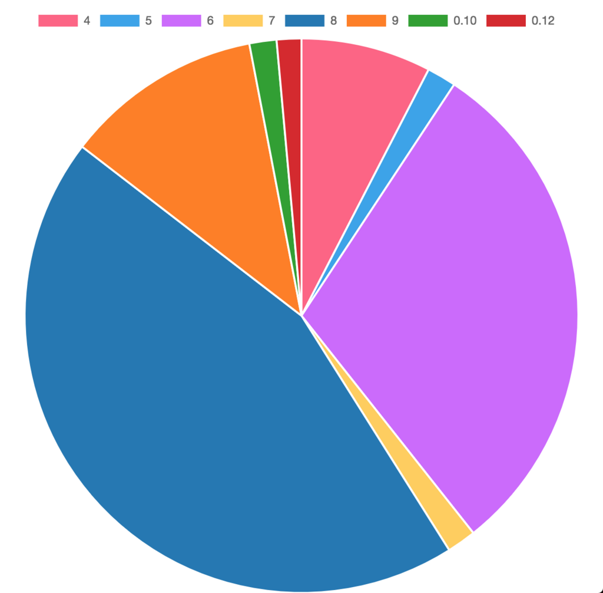
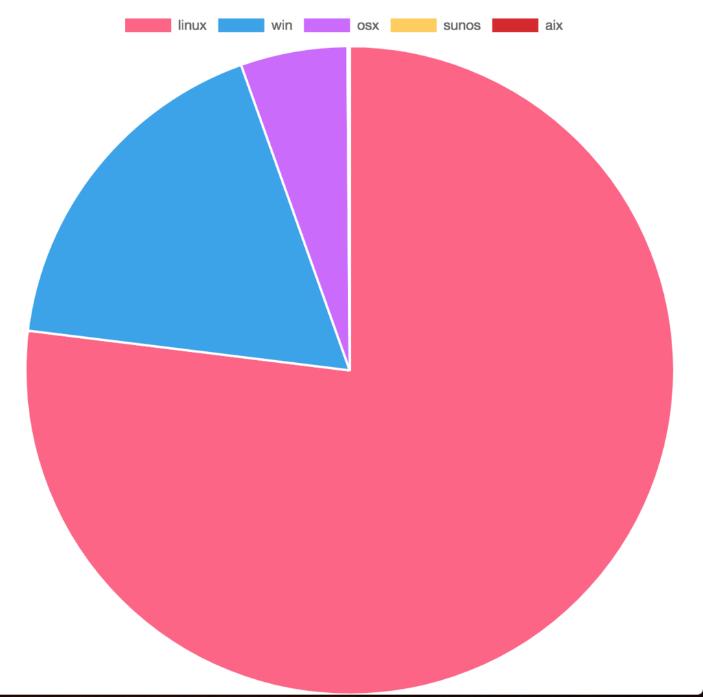
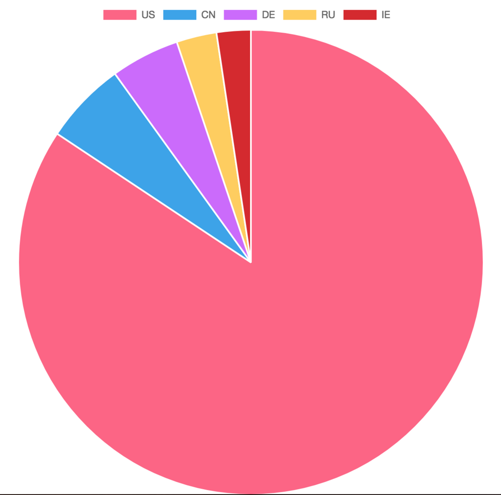
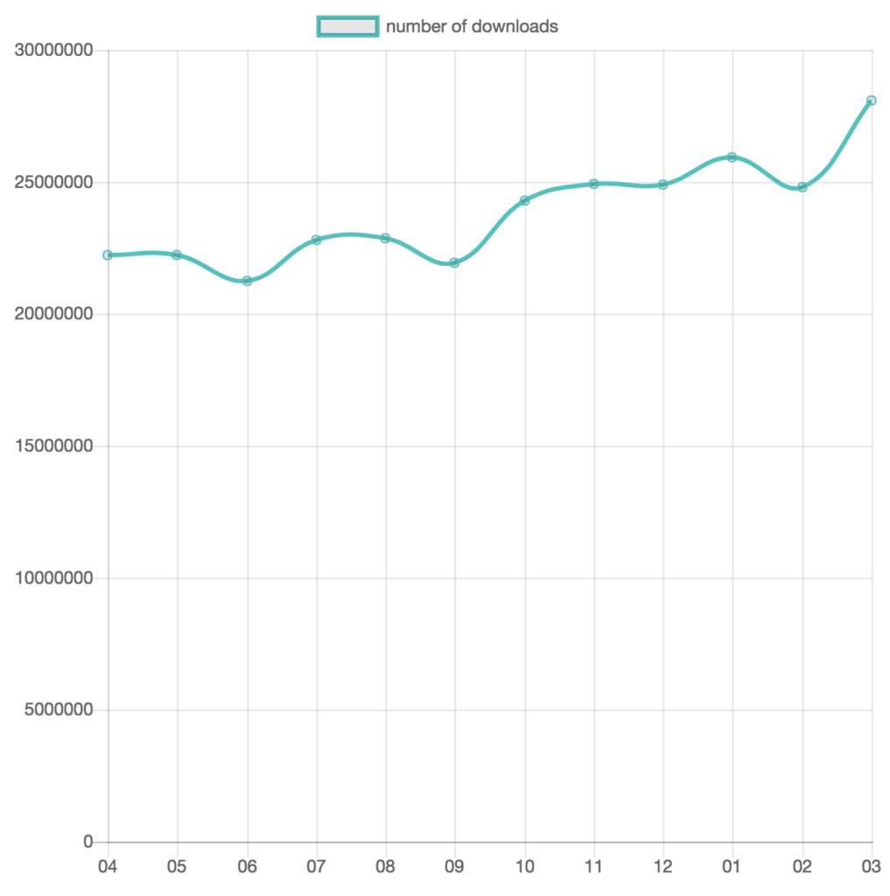
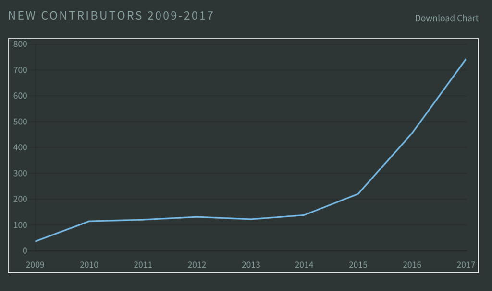

import OG from "../../components/OG.astro";

今年度も終わりなので Node.js がどれぐらいダウンロードされているかの調査を行いました。

2017 年版は nodesource が出している記事を読むと良さそう。

<OG url="https://nodesource.com/node-by-numbers" />

実は、Node.js にはダウンロード数などのデータが公開されています。

https://nodejs.org/metrics

リポジトリ

https://github.com/hiroppy/node-metrics

## 3 月のデータ

### ダウンロード数

まだ 3 月継続中ですが、2018/03/30 の 09:30 までの合計は以下のようになりました。
合計ダウンロード数は、**27,906,427**でした。

### バージョン

https://jsfiddle.net/hiroppy/77aotuvd/17

| バージョン | ダウンロード数 |
| ---------- | -------------- |
| 8          | 11,782,907     |
| 6          | 7,972,525      |
| 9          | 3,062,704      |
| 4          | 2,016,312      |
| 5          | 452,028        |
| 7          | 452,028        |
| 0.10       | 420,357        |
| 0.12       | 381,949        |

使用バージョンは、8(LTS), 9(Current), 6(LTS), 4(LTS)の順番でした。
LTS 対象である、4, 6, 8 の使用者が多いです。
また、4 が意外に多く、0.12 の人もいて驚いています。
最新のシンタックスを使いたい時は、トランスパイルがまだ必要な気がします。

4 は 2018/04 をもって、メンテナンスモードが終了されます。
6 は 2018/04 をもって、メンテナンスモードに入ります。

https://github.com/nodejs/Release#release-schedule

### OS

https://jsfiddle.net/hiroppy/09mmhb9x/2/

| OS    | ダウンロード数 |
| ----- | -------------- |
| linux | 13,350,800     |
| win   | 3,053,796      |
| osx   | 923,702        |
| sunos | 16,232         |
| aix   | 3,620          |

win ユーザが多い！！

### 国ランキング

https://jsfiddle.net/hiroppy/dphkush8/

| 国  | ダウンロード数 |
| --- | -------------- |
| US  | 19,422,144     |
| CN  | 1,319,553      |
| DE  | 1,100,201      |
| RU  | 642,479        |
| IE  | 546,270        |

アメリカと中国で 7 割近くを占める結果になりました。

ちなみに、日本は 13 位で**170,207**でした。

## 2017/04 - 2018/03

今年度の合計ダウンロード数は**286,225,092**でした 🎉

https://jsfiddle.net/hiroppy/azvh622v/8/

| 月  | ダウンロード数 |
| --- | -------------- |
| 04  | 22,225,263     |
| 05  | 22,228,303     |
| 06  | 21,249,011     |
| 07  | 22,797,850     |
| 08  | 22,864,198     |
| 09  | 21,934,121     |
| 10  | 24,290,305     |
| 11  | 24,922,497     |
| 12  | 24,897,075     |
| 01  | 25,931,180     |
| 02  | 24,801,604     |
| 03  | 28,083,685     |

毎月、20,000,000 以上をキープしている状態が続いています。
なぜか、2018/03 だけすごい多いのはなぜだろうか。。。

## 新規コントリビューター数

nodesource の記事から

どんどん、伸びてきていて、2017 年は 741 人となりました。
各地で行われている、code + learn のおかげかとは思います。

https://github.com/nodejs/code-and-learn
