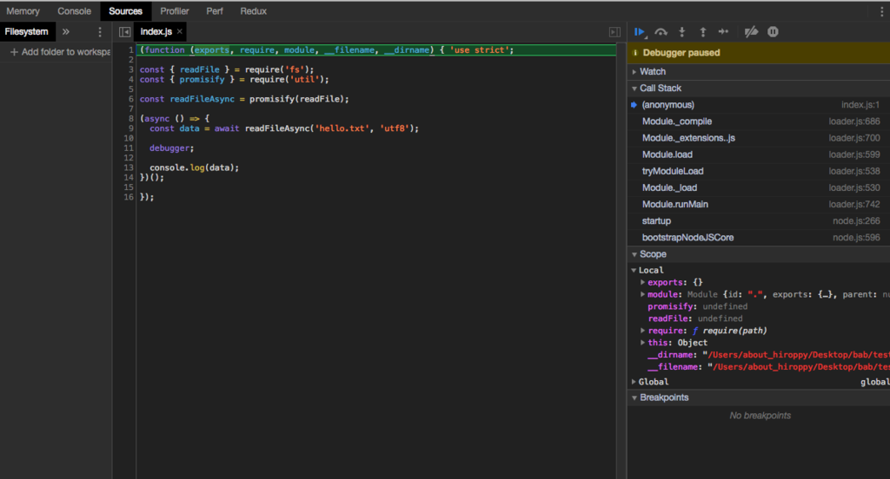
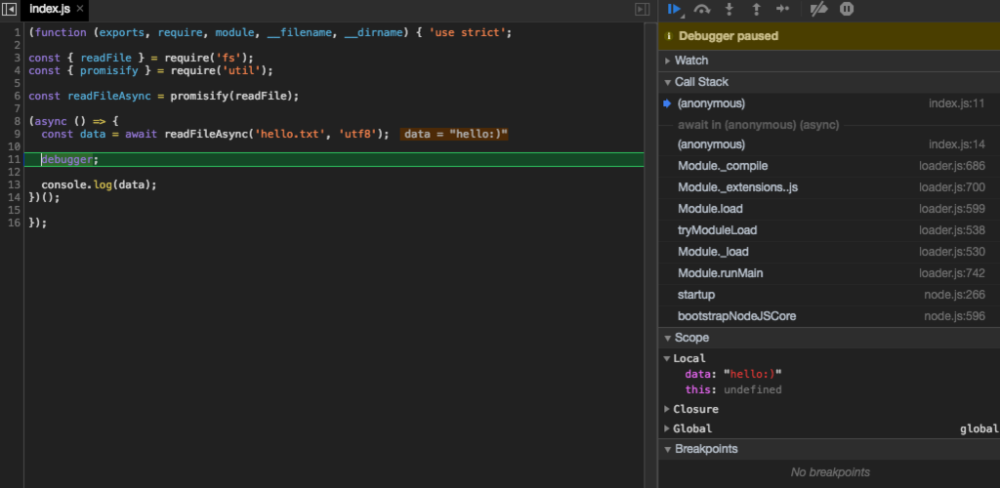
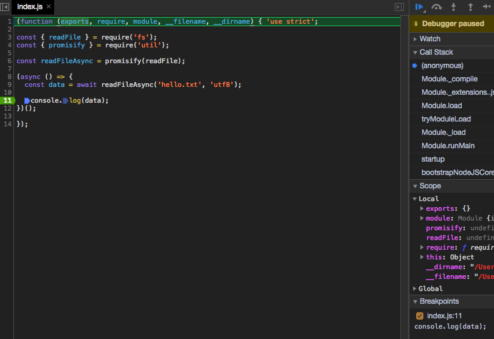
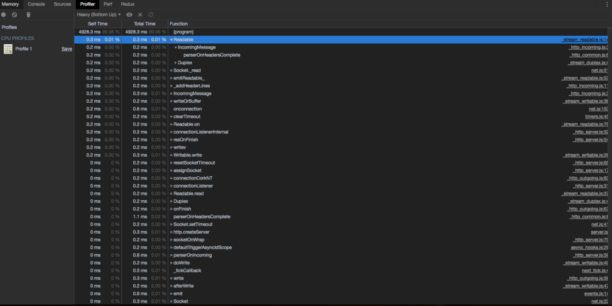
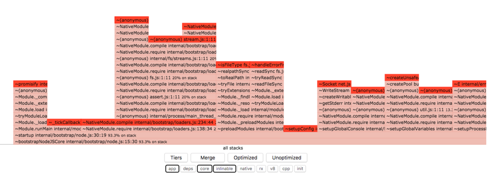
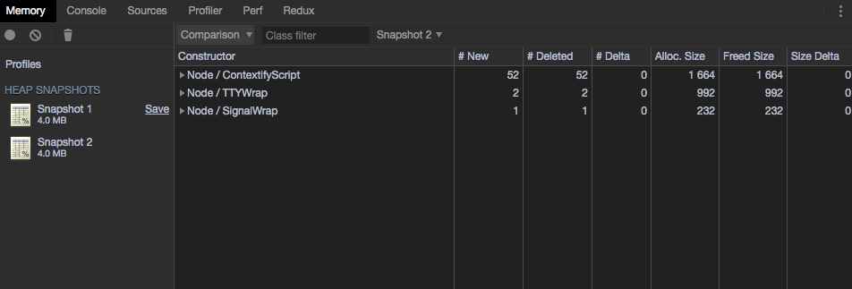
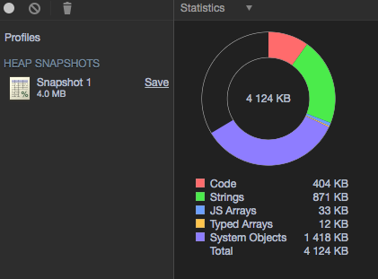
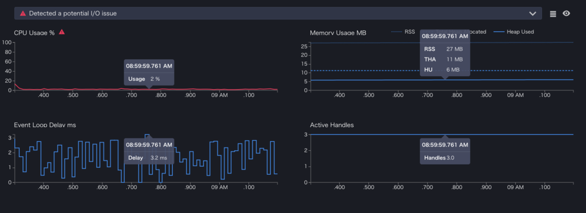
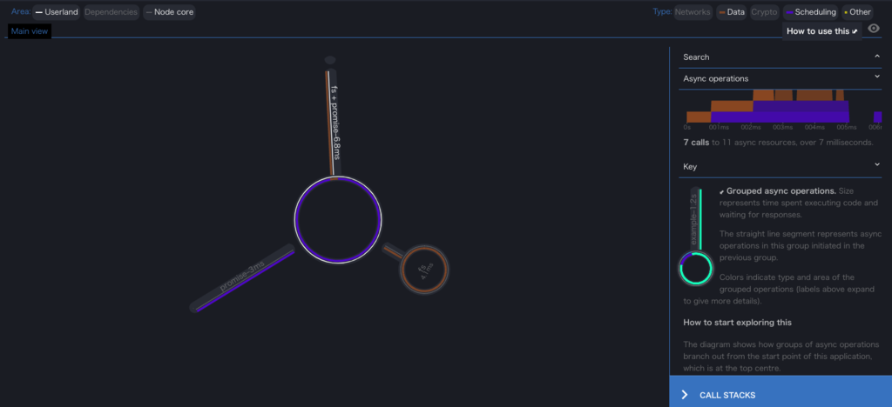
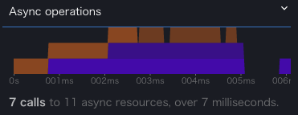

import OG from "../../components/OG.astro";

# ステップ実行

`--debug`と`--debug-brk`は Node8 の時点ですでに非推奨なので、使わないでください。

## デバッグ方法

- コンソール
- Chrome devtools

または、VSCode のような IDE に任せる

今回は、エディタ依存の話は特にしないです。

## 共通的な手順

基本的には、`debugger` を止めたい場所に置いていくことになります。

例として、以下のコードで説明していきます。

```javascript
"use strict";

const { readFile } = require("fs");
const { promisify } = require("util");

const readFileAsync = promisify(readFile);

(async () => {
  const data = await readFileAsync("hello.txt", "utf8");

  debugger;

  console.log(data);
})();
```

## コンソールでデバッグする

`inspect`というのを使います。

```
ᐅ node inspect index.js
< Debugger listening on ws://127.0.0.1:9229/e1d19bde-2450-4d9b-9736-02fd
35038351
< For help, see: https://nodejs.org/en/docs/inspector
< Debugger attached.
Break on start in index.js:1
> 1 (function (exports, require, module, __filename, __dirname) { 'use s
trict';
  2
  3 const { readFile } = require('fs');
debug>
```

実行すると、一行目に breakpoint が置かれた状態で開始されます。
`cont`(or `c`)と入力することにより、次の breakpoint まで実行されます。

```
< Debugger listening on ws://127.0.0.1:9229/e1d19bde-2450-4d9b-9736-02fd
35038351
< For help, see: https://nodejs.org/en/docs/inspector
< Debugger attached.
Break on start in index.js:1
> 1 (function (exports, require, module, __filename, __dirname) { 'use s
trict';
  2
  3 const { readFile } = require('fs');
debug> cont
break in index.js:11
  9   const data = await readFileAsync('hello.txt', 'utf8');
 10
>11   debugger;
 12
 13   console.log(data);
debug>
```

先程書いた`debugger`まで到達したことがわかります。
さて、ここで data などの値が見たいと思います。 そのようなときは`repl`というコマンドを debug に対して打つことにより確認することができます。

```
...
 13   console.log(data);
debug> repl
Press Ctrl + C to leave debug repl
> data
'hello:)'
> typeof readFileAsync
'function'
>
```

`Ctrl+C`を実行することにより、debug に戻ることが可能です。

もう一度、進めるともう`debugger`は存在しないため、終了となります。

```
  3 const { readFile } = require('fs');
debug>
debug> c
break in index.js:11
  9   const data = await readFileAsync('hello.txt', 'utf8');
 10
>11   debugger;
 12
 13   console.log(data);
debug> c
< hello:)
< Waiting for the debugger to disconnect...
debug>.exit
```

### コマンド

- `cont`, `c`
  - 実行を続ける
- `next`, `n`
  - 次のステップに行きます
- `step`, `s`
  - ステップイン(関数内の処理を実行)
- `out`, `o`
  - ステップアウト(関数内から抜け出す)
- `pause`
  - 起動コードを一時停止させる
- `setBreakpoint()`, `cb()`
  - 引数が空の場合
    - 現在行に breakpoint を設置する
  - 引数が行番号の場合 (`setBreakpoint(100)`)
    - 現在のファイルの指定された行に breakpoint を設置する
  - 引数が関数文字列の場合 (`setBreakpoint('fn()')`)
    - 関数本体の最初の文に breakpoint を設置する
  - 引数がファイル名 + 行の場合 (`setBreakpoint('foo.js', 100)`)
    - そのファイルのその行に breakpoint を設置する
- `backtrace`, `br`
  - 現在の実行フレームのバックトレースを表示する
- `repl`
  - 評価するためのデバッガーを立ち上げる

基本的に上記だけで事足りると思います。(watch は個人的にはあまり使わない。。)

## Chrome の devtools を起動させる

Chrome DevTools Protocol を用いて、デバッグを行います。

基本的に起動しぱなっしのアプリケーション(e.g. http)などでは、`--inspect`を使い、終了するコードには`--inspect-brk`を使います。
`--inspect-brk`では最初の行に breakpoint を自動的に配置します。(つまり、`node inspect` のコンソールがない版)

今回の例の場合は、すぐに終了してしまうため、`--inspect-brk`を使います。

```
ᐅ node --inspect-brk index.jsDebugger listening on ws://127.0.0.1:9229/b6e42f20-bbc5-4848-8c59-b25ccf
e0a454
For help, see: https://nodejs.org/en/docs/inspector
```

となるので、Chrome に `chrome://inspect/` と URL バーに入力すると、devices の部分に Node がつながっていることが確認できます。

`inspect`がリンクになっているので、クリックをすると Chrome の devtools が別 window で起動します。



先程の、`cont`は右ツールバーの一番左のボタンを押すことにより進めることができます。


進むと以下のようになります。 簡単にファイルから読み取った中身(`data`)が表示されました。



## 終了しないコードの値を見る

以下のコードをサンプルとします。

```javascript
"use strict";

const http = require("http");

http
  .createServer((request, response) => {
    debugger;
    response.writeHead(200, { "Content-Type": "text/plain" });
    response.write("hello:)");
    response.end();
  })
  .listen(8080);
```

このように、リクエストが来た時に内部の状態が見たいときは、`inspect` または `--inspect`を用いて起動させます。

```
ᐅ node --inspect server.js
Debugger listening on ws://127.0.0.1:9229/61ea5e2c-6674-4a08-bd8a-f1cc1d8651bd
For help, see: https://nodejs.org/en/docs/inspector
Debugger attached.
```

あとは、上記と同じ方法で値の確認等が行なえます。
breakpoint 前ではリクエストをまだ返してない状態であり、進めるとレスポンスを返します。

### リモートデバッグ

パブリック IP をリッスンするのは問題なので、リモートデバッグを有効化する場合は、トンネリングする方法が推奨されています。

<OG url="https://nodejs.org/en/docs/guides/debugging-getting-started/#enabling-remote-debugging-scenarios" />

## debugger を書くのがめんどくさい場合

### コンソールの場合

`setBreakpoint(行番号)` or `sb(行番号)`を使い、debug 上で設定することが可能です。
import している別ファイルに対しては、`setBreakpoint('foo.js', 22)`のように書くことにより breakpoint を置けます。

```
< Debugger listening on ws://127.0.0.1:9229/e0e85f75-c4c9-4d53-ab45-cc83d69ad9ba< For help, see: https://nodejs.org/en/docs/inspector< Debugger attached.
Break on start in index.js:1
> 1 (function (exports, require, module, __filename, __dirname) { 'use strict';
  2
  3 const { readFile } = require('fs');
debug> setBreakpoint(10)
  6 const readFileAsync = promisify(readFile);
  7
  8 (async () => {
  9   const data = await readFileAsync('hello.txt', 'utf8');
 10
>11   console.log(data);
 12 })();
 13
debug> repl
Press Ctrl + C to leave debug repl
> data'hello:)'
debug
> c< hello:)
< Waiting for the debugger to disconnect...
debug> .exit
```

### Chrome の場合

`--inspect-brk`を使い一旦起動させ、inspector から breakpoint を設定していきます。
Node 関係なく、行番号の部分をクリックすることにより、設置できます。
そうすると、右下の Breakpoints の枠に入ったのがわかります。



## 便利なツール

Node Inspector Manager を使うと簡単に chrome のインスペクタを開くことができます。
NIM の設定で自動で inspector を開くに設定すると、`--inspect-brk`時や`inspect`時に勝手に Chrome の Inspector が起動します。

<OG url="https://chrome.google.com/webstore/detail/nodejs-v8-inspector-manag/gnhhdgbaldcilmgcpfddgdbkhjohddkj" />

## 使い分け

基本的に、サーバー内でどうしても確認したい時以外は、Web エンジニアは慣れているだろうし、Chrome で大丈夫かなって思っています。

# CPU・メモリ等

## 便利なツール

### node-report

もうすぐしたら、Node の Core へビルトインとして入ります。

<OG url="https://github.com/nodejs/node/pull/22712" />

オプションをつけることにより、ネイティブのスタックトレース、ヒープ統計情報、プラットフォーム情報、リソース使用状況などをファイルに出力します。

以下の情報が記載されます。

- JavaScript Stack Trace
- Native Stack Trace
- JavaScript Heap and Garbage Collector
- Resource Usage
- Node.js libuv Handle Summary
- System Information

将来的にはこれを使うことになると思います。

### clinic

今回は、`clinic`を用いて説明する場合があります。
`clinic`を作っているのは、NearForm という会社で、James や Anna、Matteo などの Node.js のコミッターが所属する会社です。
docker や flame、bubbleprof の機能を提供します。

<OG url="https://github.com/nearform/node-clinic" />

## CPU

### 負荷率を取る

V8 内のプロファイラの実行をサンプリングします。
`--prof`を使い、実行コードの負荷率をみることができます。

```
ᐅ node --prof index.js
```

と実行すると、`isolate-0xNNNNNNNNN-v8.log`みたいなファイルが生成されます。
次に、

```
ᐅ node --prof-process isolate-0xNNNNNNNNN-v8.log > processed.txt
```

と実行することにより、人間が読める形式になります。

```
 [JavaScript]:
   ticks  total  nonlib   name
      2    2.4%    2.5%  Builtin: KeyedStoreIC
      1    1.2%    1.3%  LazyCompile: ~NativeModule.require internal/bootstrap/loaders.js:138:34
      1    1.2%    1.3%  Builtin: CEntry_Return1_DontSaveFPRegs_ArgvOnStack_NoBuiltinExit

 [C++]:
   ticks  total  nonlib   name
     22   26.8%   27.5%  T node::contextify::ContextifyScript::New(v8::FunctionCallbackInfo<v8::Value> const&)
      6    7.3%    7.5%  T v8::internal::Log::MessageBuilder& v8::internal::Log::MessageBuilder::operator<<<char const*>(char const*)
      3    3.7%    3.8%  t node::GetBinding(v8::FunctionCallbackInfo<v8::Value> const&)
      3    3.7%    3.8%  T node::TTYWrap::New(v8::FunctionCallbackInfo<v8::Value> const&)

 [Summary]:
   ticks  total  nonlib   name
      4    4.9%    5.0%  JavaScript
     74   90.2%   92.5%  C++
      4    4.9%    5.0%  GC
      2    2.4%          Shared libraries
      2    2.4%          Unaccounted
```

各言語ごとにセクションが存在し、そこでどれだけ負荷がかかっているかが記載されます。

<OG url="https://blog.hiroppy.me/entry/2017/11/06/095943#--prof" />

### JavaScript CPU Profile を取る

`inspect`で起動させ、Profiler タブから記録を取ります。(web 開発同様)



### フレームグラフを見る

頻繁なコードパスを可視化します。

```
$ clinic flame -- node index.js
```



x 軸はサンプルが占める割合、y 軸が stack trace を示します。
`--prof`の表記と同様に、`*` は最適化済みを示し、`~`は非最適化を示します。
薄い赤色ほど、off-CPU であり、濃い赤であるほど on-CPU です。

以下を読むとわかりやすいです。

<OG url="http://www.brendangregg.com/FlameGraphs/hotcoldflamegraphs.html" />

## メモリ

chrome の devtools にある memory から snapshot を取得します。
そこから比較をしていきメモリリークなどの発見を行います。



<br />



また、メモリリークを発見する手法として、`--trace-gc`, `--expose-gc` を使った方法もあります。

```
$ node --trace-gc test.js
[43929:0x102801c00]       39 ms: Scavenge 3.4 (6.3) -> 3.1 (7.3) MB, 0.9 / 0.0 ms  allocation failure
[43929:0x102801c00]       50 ms: Scavenge 3.6 (7.3) -> 3.5 (8.3) MB, 1.2 / 0.0 ms  allocation failure

$ node --optimize_for_size --max_old_space_size=4096 --gc_interval=100 #このようにV8のGCを操作することも可能
```

<br />

<OG url="https://postd.cc/simple-guide-to-finding-a-javascript-memory-leak-in-node-js" />

## CPU・Memory・Event Loop Delay・Active Handles の推移を見る

```
clinic doctor -- node server.js
```

実行が短いプログラムには使えないことに注意してください。



イベントループの遅延が見えるのがありがたいです。

## 区間測定 及び 関数実行時間測定を行う

`perf_hooks`モジュールを使い、区間の実行時間、関数の実行時間、GC のコールされた種類等を検知し、改善に役立てます。

`renderToString` にかかる時間を計測する例です。

```javascript
const { performance, PerformanceObserver } = require("perf_hooks");
const React = require("react");
const { renderToString } = require("react-dom/server");

const render = performance.timerify(renderToString);
const obs = new PerformanceObserver((list, observer) => {
  const data = list.getEntries();

  data.forEach((l) => {
    if (l.name === "renderToString") console.log("duration", l.duration);
  });

  observer.disconnect();
});

obs.observe({ entryTypes: ["function"], buffered: true });

const Main = (props) => {
  return React.createElement(
    "ul",
    null,
    [...new Array(props.n)].map((_, i) => {
      return React.createElement("li", { key: i }, "test");
    }),
  );
};

render(Main(1000000));
```

<br />

<OG url="https://slides.hiroppy.me/future-of-node/#20" />

## bubbleprof を見る

これは clinic が作った手法で、Node のプロセスを可視化します。
非同期処理を監視し、マッピングします。



userland, dependencies, Node Core でそれぞれ処理にかかった時間がわかります。
また、非同期処理の実行回数と時間もわかります。



この場合だとファイル読み込みに 6.8ms かかったことになります。

# Network

## 負荷試験

`autocannon` を使い、簡単に測定を行います。

<OG url="https://github.com/mcollina/autocannon" />

<br />

```
$ node server.js
$ autocannon  localhost:8080 -c1000
Running 10s test @ http://localhost:8080
1000 connections

Stat         Avg     Stdev  Max
Latency (ms) 68.95   84.55  1594.74
Req/Sec      14454.7 5049.5 21068
Bytes/Sec    2.19 MB 769 kB 3.18 MB

145k requests in 10s, 21.8 MB read
1 errors (0 timeouts)
autocannon localhost:8080 -c1000  4.91s user 2.37s system 69% cpu 10.433 total
```

# 関連記事

<OG url="https://github.com/nodejs/diagnostics/issues/148" />

<br />

<OG url="https://blog.hiroppy.me/entry/ssr-sample" />

<br />

<OG url="https://blog.hiroppy.me/entry/2017/11/06/095943" />
