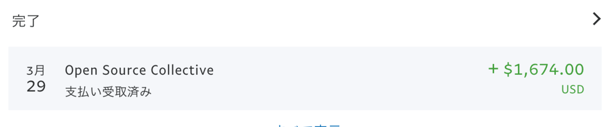

import OG from "../../components/OG.astro";
import TwitterCard from "../../components/TwitterCard.astro";

[追記]
無事、税理士さんと相談して支払いを完了しました 🎉

<OG url="https://opencollective.com/webpack/expenses/7189" />

また、よければ私をサポートしてください 🙏

<OG url="https://www.patreon.com/hiroppy" />

以下、編集前の記事

---

<TwitterCard id="1106771823851651072" height={280} />

**注意: あくまでもこれは webpack の話です**

## 2 月分の OSS 活動費

2 月分の OSS 活動費が以下の額で支給されます。

$1674(186,620.87 円)

Total: $2093(233,331.83 円)

## 現状の自分について

今年から webpack に復帰しました。(以前活動してた時はまだ openCollective に参加してない)

そして、本業の他に個人事業主をやっていますが、今は税理士がいません。
日本では他の会社のお仕事もしているため、毎月ごとに請求書を書いて提出しています。

## 今回の問題点

**海外に対する請求書の書き方がわからない！！**

法的請求書でないといけないと言われているのですが、一体それは何を書けばいいんだって感じで悩んでいます。

多分、日本で提出している請求書ではダメそうだよなぁとか思ったりしています。

また、税処理周り等もわからないため、法律等に詳しい人が必要となりました。

そして、今、自分はアイルランドに在住しており、日本にはいないため、税理士さんや法律家さんを探すのが大変です。
またこの処理は 25 日以内に行わないといけないため、今回は柔軟に対応できず受け取らないかもしれません。
しかし、受け取らないのは今回だけにしたいので、今のうちに海外でのお金周りの扱いを理解しておきたいと思っています。

## 記事を書いた目的

**OSS でもお金を稼ぐことができる** という事実を多くの人に知ってもらえたら幸いだと思いますし、これで貢献に対してモチベーションを見出してくれる方がいればさらに嬉しい限りです。

関連記事

<OG url="https://blog.hiroppy.me/entry/current-status-and-future-of-oss" />

また、日本人で openCollective の配給を受けている人がいれば話してみたいと思っていてそのために書いています。(が、自分はしらない)

## 仕事として OSS 活動を行う場合

会社の時間を使って仕事として OSS を貢献している場合は、お金は出ません。
その場合は、会社に対して社会的影響を与えるものを受け取ることができます(曖昧な表現にしているのは、自分は実際に仕事で oss を行っておらずわからないため)

自分は、OSS を専務するエンジニアが会社にいても実際、意味はあると思っていますし、そういう会社が増えてくれることを切実に願います。

現状の自分は、webpack 以外にも様々な OSS をメンテナンスしたりしています。
以下のツイートが全てで自分はそろそろ時間が足りなくなってきています。

<TwitterCard id="1106094638656561153" height={280} />

## 寄付

我々はここでメンテナに対し資金を使い配給しています。
もし、応援してくれる方や会社があれば、寄付してくれると本当に嬉しいです。

<OG url="https://opencollective.com/webpack" />

また、今年も去年に引き続き Google Summer of Code の参加をします。

<OG url="https://ja.wikipedia.org/wiki/Google_Summer_of_Code" />

 

<OG url="https://summerofcode.withgoogle.com/organizations/6230025286713344" />

## 個人に対する寄付

Patoreon をはじめましたので、もし私個人を応援してくださる方がいたらこちらでお願いします。

<OG url="https://www.patreon.com/hiroppy" />

OSS をやるモチベーションの支えになります。

## さいごに

今後も自分はこのように収入を得ていくでしょう。
このような人をサポートしてくれる会社や個人がいてくれると本当に助かります。
また、このような収入スタイルを確立していく人が増えていくことを望んでいます。

もし、自分の悩みを解決してくれる法律に詳しい方？や税理士の方を知っている人がいれば、連絡(紹介)ください！！
次は資金を得たいので助けてほしいです。。

よろしくおねがいします。
