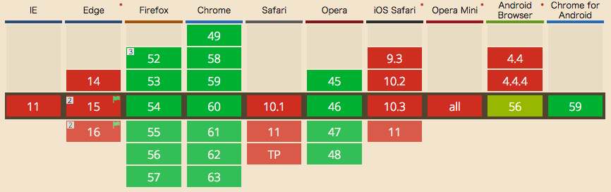
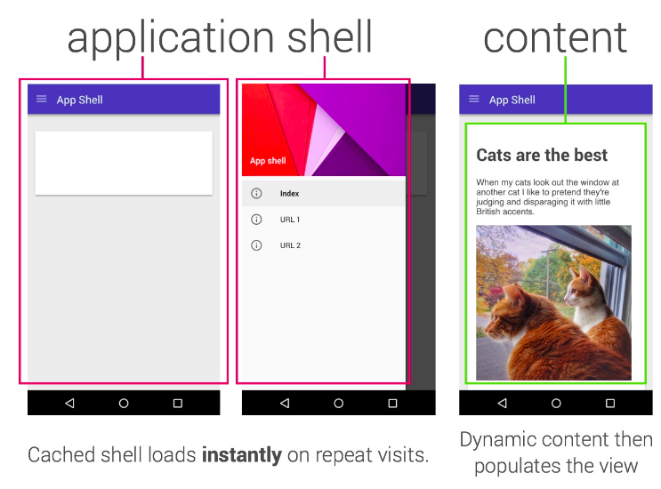
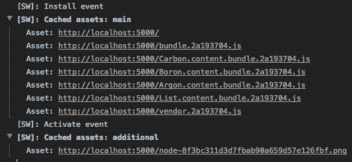
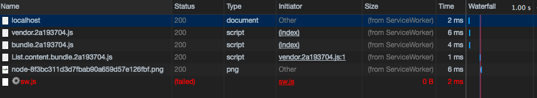

import OG from "../../components/blog/OG.astro";

そういえば PWA の実装したことがなかったなと思ったので少し触ってみた。

# PWA(Progressive Web Apps) とは？

インストールが不要で、不安定なネットワークでも素早く起動し、プッシュ通知を可能にします。
また、ホーム画面にアイコンも表示でき、アプリと同様の扱いをすることが可能となります。

つまり、アプリに近づけた web ですね。

以下の記事が詳しいのでそちらを見てください;)

<OG url="https://developers.google.com/web/fundamentals/getting-started/codelabs/your-first-pwapp" />

## 目的

- https, localhost でしか Service Worker は動かないので常に安全
- Service Worker の更新プロセスにより常に最新
- App Shell モデルによる構成で UI をネイティブにさらに近づける
- プッシュ通知による再エンゲージメント
- キャッシュすることにより、ネットワークの依存度を下げる

## 技術スタック

### Service Worker

対応状況は以下の通り



https://caniuse.com/#feat=serviceworkers

代表的な提供機能

- オフライン機能
- push 通知
- バックグラウンドコンテンツの更新
- コンテンツキャッシュ

レシピ: https://serviceworke.rs

### PWA の view

PWA には App Shell と Content というものがあります。
以下の図を見るとわかりやすいと思います。



<OG url="https://developers.google.com/web/updates/2015/11/app-shell" />

つまり、アプリケーションシェルというのはダイナミックコンテンツじゃない部分を指します。

#### App Shell

一番、PWA の実現で難しい部分であり、一番パフォーマンスの向上を図ることが期待される部分(らしい)
シンプルなデザインコンセプトで設計されます。
Service Worker のキャッシング機能により、パフォーマンスの向上が可能です。
最上位のアプリのロジック、ルーターなどがあります。

#### Content

動的なビューです。例えば Twitter のタイムラインとか。
ここもそれぞれのコンテンツで必要に応じて JS のチャンクは細かく切られます。

### キャッシュ戦略

基本的に、App Shell と Content の JS は別チャンクにするべきです。
Service Worker にそれぞれのチャンクを保持させることにより、ユーザが前のページに戻った時に早く読み込むことが可能です。
理論上、App Shell の読み込みと Content の読み込みを別にすることにより、パフォーマンスとユーザビリティの向上が図れるらしいです。
App Shell はどのページでも常に読み込まれ、Content は必要に応じて読み込むという感じです。

### 読み込みフロー

PWA は先にその時に必要なものだけを取り、それをキャッシュする仕組みです。
なので webpack でチャンクを細かく切ることにより、必要なリソースだけを読み込めるように設計します。
その後、Service Worker 側で追加のリソースを事前に取得して、将来的な読み込みを行います。
また、ローディングの順序は App Shell で基本的な UI を構築し、その後にコンテンツです。

### Web App Manifest

`manifest.json`に名前、カラー、ホーム画面に置くアイコンの設定等を書きます。
PWA には必須です。

以下のようなスキーマになります。

```json
{
  "name": "My PWA Sample",
  "orientation": "portrait",
  "display": "standalone",
  "start_url": ".",
  "short_name": "MyPWA",
  "description": "This is a sample App!",
  "background_color": "#f5f5f5"
}
```

また、HTML では以下のように指定します。

```html
<link rel="manifest" href="/manifest.json" />
```

<br />

<OG url="https://developers.google.com/web/fundamentals/engage-and-retain/web-app-manifest" />

今回は、webpack-pwa-manifest というプラグインがあったのでそれを使いました。

https://github.com/arthurbergmz/webpack-pwa-manifest

## デザイン

PRPL pattern というのがあります。
より高速にモバイルで web のエクスペリエンスを提供します。
Push、Render、Pre-cache、Lazy-load で構成されます。

以下の Addy Osmani の記事がとてもわかりやすいです！

<OG url="https://developers.google.com/web/fundamentals/performance/prpl-pattern" />

また今度、ブログにでも書こうかと思います。

## Firefox と Chrome しか Service Worker ないけどどうするの？

普通の HTML、CSS、JS なので問題はありません。
Service Worker はあくまでもネイティブ機能に近づける実現方法なので今までどおりにフォールバックします。

## ネットワーク

Twitter Lite で http/2, GraphQL が使われています。

# 実装

https://github.com/abouthiroppy/pwa-sample

上記のリポジトリで開発してみました。
SPA + Service Worker で実現しています。
今回は CSR のみです。

## ライブラリ

react, react-router で構築しました。
詳しくは、リポジトリの`webpack.config.js`とかを見てください。

### webpack-offline

Service Worker のファイル吐き出しと結合を行ってくれるプラグイン。

注意点として、キャッシュファイルの保存容量が超えた時のエラーがわかりづらい。
`Uncaught (in promise) DOMException: Quota exceeded. service worker` は多分そのエラー。

なので、基本的には dev では offline を使わないでプロダクションのときにだけ使うようにしたほうがいい。(HMR もおそらくできないので)
ただ、もちろん sw に本当に接続できているか確認したいときはあるのでそのときはライブラリ群のチャンクをキャッシュから外してデバッグしている。

様々なオプションがあるのでチューニングによるパフォーマンスとかの変化はありそう。

## 構成

### ファイル

```
                                    Asset       Size  Chunks                    Chunk Names
                       vendor.2a193704.js     806 kB       5  [emitted]  [big]  vendor
node-8f3bc311d3d7fbab90a659d57e126fbf.png    3.73 kB          [emitted]
         Boron.content.bundle.2a193704.js     2.3 kB       1  [emitted]         Boron.content
         Argon.content.bundle.2a193704.js     2.3 kB       2  [emitted]         Argon.content
          List.content.bundle.2a193704.js    1.89 kB       3  [emitted]         List.content
                       bundle.2a193704.js    9.28 kB       4  [emitted]         bundle
        Carbon.content.bundle.2a193704.js     2.3 kB       0  [emitted]         Carbon.content
                            manifest.json  367 bytes          [emitted]
                               index.html  462 bytes          [emitted]
                                    sw.js    23.2 kB          [emitted]
               appcache/manifest.appcache  265 bytes          [emitted]
                   appcache/manifest.html     3.3 kB          [emitted]
```

ファイルは上記のように分けました。
`vendor.js`ではライブラリのコードのみが入っています。
なので一番サイズが大きいです。
ライブラリのバージョンが頻繁に変わらないためコアコードから隔離します。

`bundle.js`が App Shell です。
ルーティングと Toolbar を持っています。
ベストプラクティスがわからないですが、これは一緒にしないほうがいいかもです。

`*.content.bundle.js`が content です。
今回は、Argon, Boron, Carbon の三種類とルートページのリスト、合計 4 チャンクあります。
_ちなみに Node の LTS の名前がこの三種類です(v4, v6, v8)_

### ルーティング

慣れている react-router を使う。
必要な時に content のチャンクを取得するために lazy load を使います。

react-router には慣れているつもりだったが、v4 から`getComponent`がなくなっていることに気付いてなかった。。

昔は、

```javascript
<Route
  path="/"
  getComponent={(location, callback) => {
    require.ensure(
      [],
      (require) => {
        callback(null, require("./Root"));
      },
      "Root",
    );
  }}
/>
```

みたいに書けたはずなのに今は書けなくなっている。

調べた限り多分、FB の方が書いてたこれが一番キレイな書き方。

https://gist.github.com/acdlite/a68433004f9d6b4cbc83b5cc3990c194

うーん。。。 ラッパーを書かないといけないの。。(_あと react-router のリファレンス読みづらいんだよね。。_)

ということで、これをラップしてたライブラリがあったので今回はそれを使った。

https://github.com/mhaagens/lazy-route

ただ、残念なことに`<Switch>`が対応してなくて、つらい。。
今 PR が出ているのでそれ待ちという状態です。

https://github.com/mhaagens/lazy-route/issues/4

しょうがないので、`/`に対して`exact`を付けることにした。

```javascript
// 長いので省略部あり

const Routes = () => (
  <App>
    <Route
      exact
      path="/"
      render={() => (
        <LazyRoute
          component={
            import(
              /* webpackChunkName: 'List.content' */ "./components/contents/List"
            )
          }
        />
      )}
    />
    <Route
      path="/argon"
      render={() => (
        <LazyRoute
          component={
            import(
              /* webpackChunkName: 'Argon.content' */ "./components/contents/Argon"
            )
          }
        />
      )}
    />
  </App>
);
```

App は View 全体を構築します。
この中に Toolbar が入っており、`this.props.children`が上記に当てはまったルートになりそれをレンダリングします。
よく react-router でやる部分的更新の手法ですね。

しかし、今回はレンダリング時にファイルを取得し読み込み流したいので動的に取得する実装が必要です。
なので stage-3 の dynamic import を使う必要があります。(webpack2 以降はデフォルトで入っています)

## アセットのインストール



このような感じで保存される。
キャッシュの種類は `main`, `additional`, `optional` の三種類ある。

`main`は install イベント時に service worker にキャッシュされ、もし失敗したら全部のキャッシュはされません。
`additional`は`main`が正常にロードされた後、ロードされます。
`optional`はサーバから fetch されたときのみキャッシュされるので、事前にダウンロードしません。

https://github.com/NekR/offline-plugin/blob/master/docs/caches.md

今回は`index.html`と各種 JS,画像を保存しているので、これでたとえ serve していなかったりネットを切っている状態でも恐竜が現れるのではなく通常のページが表示されます。

ネットワークタイムラインはこのようになります。



size のところを見るとわかりますが、Service Worker からコードを取得しています。
ネットワークが切れているので、sw.js の取得は失敗しますがコアコードはすでに取得済みなのであたかも生きているようにレンダリングされる。
また高速です。(vendor.js とか重いのに。。)

## API 周り

今回は、通信周りの実装を行っていないのでコードはありませんが、
Twitter Lite では API を叩いた後 Normalizr を通して Redux に効率よくデータを渡しています。
また、IndexedDB にもその結果を保存します。

## SSR

今回のサンプルではやっていませんが、基本的にはやったほうがいいと思っています。
Twitter Lite では、認証をし、初期状態の構成をし、App Shell のレンダリングをする設計になっています。
Twitter Lite をインスペクタで色々見ると楽しいかも。

# 資料

- https://developers.google.com/web/fundamentals/getting-started/codelabs/your-first-pwapp
- https://developers.google.com/web/fundamentals/performance/prpl-pattern
- https://blog.twitter.com/engineering/en_us/topics/open-source/2017/how-we-built-twitter-lite.html
- https://medium.com/@paularmstrong/twitter-lite-and-high-performance-react-progressive-web-apps-at-scale-d28a00e780a3

# さいごに

手探りでやっていてこれがすべてベストプラクティスではなかったり、誤読があるかもしれないので、何かあれば PR や Issue、コメントなど出してもらえると助かります:p
