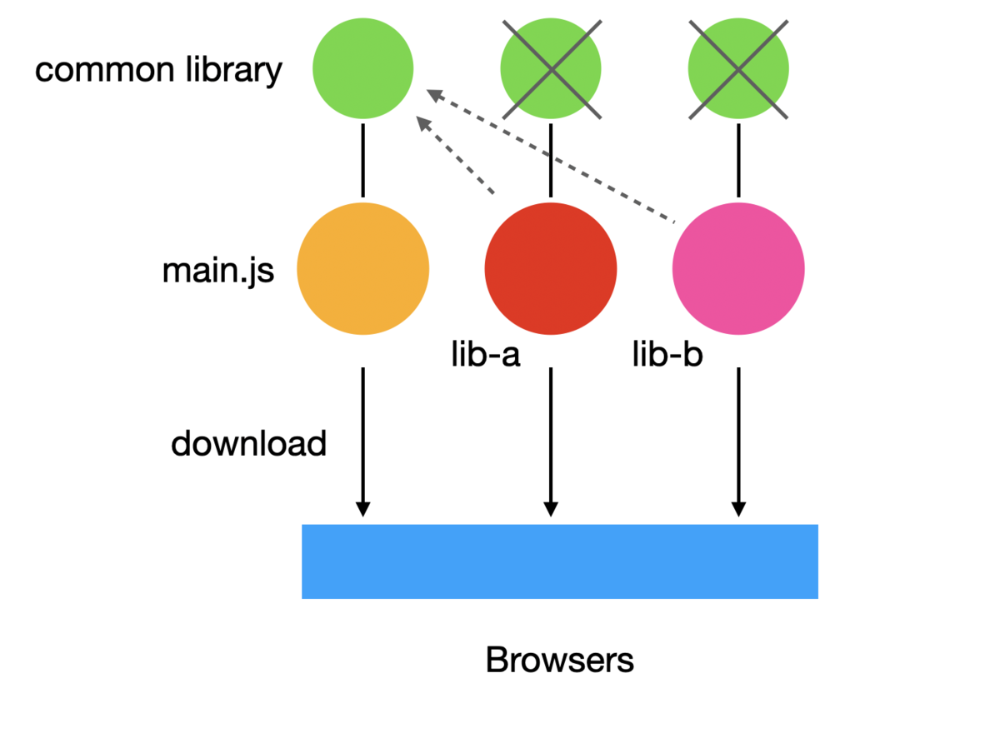

import OG from "../../components/OG.astro";
import TwitterCard from "../../components/TwitterCard.astro";

予定では、明日の 10 日に webpack のメジャーバージョンである v5 がリリースされますが、まだエコシステムが安定していない可能性があるため、注意してアップグレードを行ってください。

<OG url="https://github.com/webpack/webpack/issues/11406" />

change log: https://github.com/webpack/changelog-v5

移行ガイド: https://webpack.js.org/migrate/5

## 追加機能

### Persistent Caching

このバージョンからは今までメモリ上でしか行ってなかったファイルシステムによるキャッシュが導入されます。以下のように設定することにより、大幅な速度改善が見込めます。

```javascript
module.exports = {
  cache: {
    type: "filesystem",
    buildDependencies: {
      config: [__filename],
    },
  },
};
```

なし ↓

```
asset main.js 36.3 KiB [emitted] [minimized] (name: main)
orphan modules 584 KiB [orphan] 554 modules
cacheable modules 117 KiB
  ./src/index.js + 103 modules 117 KiB [built] [code generated]
  ./src/foo.js 21 bytes [built] [code generated]
webpack 5.0.0-rc.2 compiled successfully in 1836 ms
```

あり ↓

```
asset main.js 36.3 KiB [compared for emit] [minimized] (name: main)
cached modules 700 KiB [cached] 556 modules
webpack 5.0.0-rc.2 compiled successfully in 429 ms
```

詳しくは以下の記事を参照にしてください。

<OG url="https://blog.hiroppy.me/entry/webpack-persistent-caching" />

### Module Federation

リポジトリ間(バンドル間)を跨ぐときにライブラリなどの重複しているコードを以下のように効率よく扱いバンドルサイズを下げる仕組みです。この機能はお互いの webpack と連携を取り合う必要があるため互いに webpack@5 である必要があります。



詳しくは以下の記事を参考にしてください。

<OG url="https://blog.hiroppy.me/entry/module-federation" />

### assetModules type の追加

今まで画像などを読み込むときに、file-loader や url-loader, raw-loader などを使っていましたがそれがネイティブサポートされました。

```javascript
module.exports = {
  output: {
    assetModuleFilename: "images/[hash][ext]",
  },
  module: {
    rules: [
      {
        test: /\.(png|jpg|gif)$/,
        type: "asset/resource",
      },
    ],
  },
};
```

詳しくは以下の記事を参考にしてください。

<OG url="https://blog.hiroppy.me/entry/webpack-asset-modules" />

### チャンク名が ID へ変更

今まで以下のように`webpackChunkName`と書かなければ読めないファイル名となっていましたが、人が読める形となります。それに伴い、開発中での`webpackChunkName`の指定をする必要がなくなることが期待されます。

```javascript
(async () => {
  await import(/* webpackChunkName: "foo" */ "./foo");
})();
```

名前をつけたときの出力

```
asset main.js 2.79 KiB [emitted] [minimized] (name: main)
asset foo.js 114 bytes [emitted] [minimized] (name: foo)
runtime modules 7.23 KiB 10 modules
cacheable modules 217 bytes
  ./src/index.js 190 bytes [built] [code generated]
  ./src/foo.js 27 bytes [built] [code generated]
webpack 5.0.0-rc.4 compiled successfully in 274 ms
```

v5 のデフォルトでは以下のように`deterministic`という設定の新しいアルゴリズムが追加され、モジュール/チャンクの名前に 3~4 桁の数値 ID が付与されるようになります。これにより、ハッシュ化されたモジュール ID による gzip でのパフォーマンス低下は修正されました。

```
asset main.js 2.79 KiB [emitted] [minimized] (name: main)
asset 717.js 114 bytes [emitted] [minimized]
runtime modules 7.23 KiB 10 modules
cacheable modules 186 bytes
  ./src/index.js 159 bytes [built] [code generated]
  ./src/foo.js 27 bytes [built] [code generated]
webpack 5.0.0-rc.4 compiled successfully in 283 ms
```

ファイル名を自動的に付与したい場合

```javascript
module.exports = {
  optimization: {
    chunkIds: "named",
  },
};
```

<br />
``` asset main.js 2.8 KiB [emitted] [minimized] (name: main) asset src_foo_js.js
123 bytes [emitted] [minimized] runtime modules 7.23 KiB 10 modules cacheable
modules 186 bytes ./src/index.js 159 bytes [built] [code generated] ./src/foo.js
27 bytes [built] [code generated] webpack 5.0.0-rc.4 compiled successfully in
256 ms ```

`optimization.chunkIds` に `named` を追加すればファイル名が確定しますが本番環境では表示されていいものなのかを検討してください。また、`optimization.splitChunks.name`はなくなったのでこちらに移行してください。

### import.meta のサポート

```javascript
// ./src/index.js
console.log(import.meta.url);
console.log(import.meta.webpack);
```

<br />
```javascript // ./dist/main.js //
生成されたファイルは固定値として入り、import.meta.url, webpackは存在しなくなる
console.log("file:///Users/hiroppy/webpack/src/index.js"); console.log(5); ```

また、HMR 時に今までは以下のように書いていましたが、これからは`import.meta.webpackHot`を使うことが可能です。これを使うことにより、Node.js の module への依存を減らし、ESM に沿うような書き方に変わります。

```javascript
// <= 4
if (module.hot) {
  module.hot.accept();
}

// >= 5
if (import.meta.webpackHot) {
  import.meta.webpackHot.accept();
}

// or
import.meta.webpackHot?.accept();
```

### `data`, `file`, `http(s)`のプロトコルのサポート

```javascript
import x from "data:text/javascript,export default 42";
console.log(x); // 42

import y from "file:///Users/hiroppy/webpack/src/index.js";
```

また、フラグメント(`#`)もサポートされました。

```javascript
const eIndexOf = require("es5-ext/array/\0#/e-index-of#fragment");
```

http(s)プロトコルは、まだ完全にサポートされていないため以下の設定が必要です。

```javascript
const webpack = require("webpack");

module.exports = {
  plugins: [
    new webpack.experiments.schemes.HttpUriPlugin(),
    new webpack.experiments.schemes.HttpsUriPlugin(),
  ],
};

// index.js
import codeOfConduct from "https://raw.githubusercontent.com/webpack/webpack/master/CODE_OF_CONDUCT.md";
console.log(codeOfConduct);
```

### Native Worker のサポート

`new Worker(new URL('...', import.meta.url))`が WebWorker を作るようにサポートされました。これは SharedWorker も同様です。

```javascript
const fooWorker = new SharedWorker(
  new URL("./foo-worker.js", import.meta.url),
  {
    name: "foo",
  },
);
```

### publicPath の自動化

新しくデフォルト値として`auto`が追加され、`document.currentScript`, `document.getElementsByTagName('script')`, `self.location` の中から自動的に決定されます。注意点として、IE では`document.currentScript`がサポートされていないため、deferred か async のスクリプトには使用することができません。

```javascript
module.exports = {
  output: {
    publicPath: "auto",
  },
};
```

### Tree Shaking の最適化

ネストされたモジュールの場合、今までは使われていない`b`は削除できませんでしたが v5 からは追跡可能となりできるようになりました。

```javascript
// inner.js
export const a = 1;
export const b = 2;

// module.js
import * as inner from "./inner";
export { inner };

// user.js
import * as module from "./module";
console.log(module.inner.a);
```

v4 では、モジュールの関係性しか見ていませんでしたが、v5 から入った`optimization.innerGraph`により、内部モジュールへの最適化も行えるようになりました。

```javascript
import { something } from "./something";

function usingSomething() {
  return something;
}

export function test() {
  return usingSomething();
}
```

以下のケースが対象です。

- 関数宣言
- クラス宣言
- 変数宣言 及び `export default`

`Optimization.sideEffects`では、ソースコードから副作用のないモジュールの単純なケースを検出できるようになりました。クラスおよび関数宣言、簡単な init 式を使用した変数宣言、`if`、`while`、`for`、`switch`、`export`、`import`、簡単なフラグを使用した関数呼び出し 等です。

また、CJS もサポートされました。

- `module.exports = require('...')`
- `module.exports.a.b.c = require('...').a.b.c`
- `Object.defineProperty(module.exports, 'xxx', ...)`
- `require('abc').xxx`

このサポートは、ESM、CJS 間でも動くので、今後どちらのモジュールシステムを使っているかを気にせずに最適化行えるようになります。

これは別の記事で詳細に説明するので予定です。

### output.filename, output. chunkFilename の関数化

`output.filename`は今まで文字列しか受け取りませんでしたが、関数にすることが可能となったため更に柔軟な設定を表現することが可能となります。

```javascript
module.exports = {
  output: {
    filename: ({ chunk }) => {
      if (chunk.name === "main") return "main.bundle.[contenthash].js";
      return "foo.bundle.[contenthash].js";
    },
  },
};
```

### externalsType の追加

`externalsType`に`promise`, `import`, `script`が追加され、より柔軟に対応できるようになりました。

- promise: `var`と同様だが、非同期モジュールとなる
- import: `import()`を使い、非同期のネイティブ ESM モジュールを読み込む
- script: `<script>`を使い、事前に定義されたグローバル変数を公開するスクリプトを読み込む

```javascript
module.exports = {
  externalsType: "promise",
};
```

### target の詳細化と browserslist のサポート

`target`に対して、詳細な設定ができるようになりました。 配列を受け取るようになり、`target: ['web', 'es2015']` 等の書き方が行えるようになりました。 また、browserslist がされたため、`web`の場合は`target`の設定は不要となります。

<OG url="https://github.com/browserslist/browserslist" />

デフォルト値は`target: 'browserslist'`となり、フォールバック先は変わらずに`web`となります。

### TypeScript 型定義ファイルの提供

`@types/webpack`は不要になりました。

```javascript
import { WebpackOptionsNormalized } from "webpack";

const config: WebpackOptionsNormalized = {
  entry: "index.js",
  output: {
    filename: "bundle.js",
  },
};
```

### splitChunks でのサイズ設定値の変更

今までは、JS のみのチャンクサイズでしたが、さらに詳細に指定できるようになりました。

```javascript
module.exports = {
  optimization: {
    splitChunks: {
      cacheGroups: {
        test: {
          name: "test",
          minSize: {
            javascript: 100,
            webassembly: 100,
            style: 100,
          },
        },
      },
    },
  },
};
```

また、本番環境での`minSize`のデフォルト値は`20k`となりました。

## 実験的段階

### top-level-await のサポート

シンタックスは ESM の仕様に沿いますが、まだ stage-3 なので実験的フェーズです。

<OG url="https://github.com/tc39/proposal-top-level-await" />

<br />

```javascript
// webpack.config.js
module.exports = {
  experiments: {
    topLevelAwait: true,
  },
};
```

<br />
```javascript const x = await
import("file:///Users/hiroppy/Desktop/webpack-5/src/foo.js");

console.log(x);

````

### script タグでのモジュールサポート

バンドル時に使われる IIFE が取り除かれ、`<script type="module">`経由で呼び出される形に出力されます。この場合、仕様に沿い厳格モードと遅延ロードが有効化されます。

```javascript
module.exports = {
  experiments: {
    outputModule: true,
  },
};
````

## 破壊的変更

### 最低要求バージョンが Node.js@10 へ

webpack 及び webpack のコアにおけるエコシステムが要求する Node.js のバージョンの最低値は 10 となります。

### Node.js の polyfill の自動挿入が廃止

メンバー間でも賛否両論がありましたが、理由としては以下のような目的があります。

- webpack は web へ向かっている
- polyfill 自体が完全互換なものではない
- メンテナンスコストの高さ

自分が経験した例としては、`process`や`util`に依存している Node.js のコードをクライアントサイドで使う場合があり、v5 に上げたら動かなくなる場合があります。

実際に webpack4 まで使っていた polyfill は以下のリポジトリで管理されているので、これを参考にして各自で追加する必要があります。

<OG url="https://github.com/webpack/node-libs-browser" />

これに伴い、`node.*`の中のネイティブモジュールがすべて廃止となります。 また、`global`, `__filename`, `__dirname`はデフォルトで`false`の値となります。

```javascript
module.exports = {
  node: {
    // Buffer: false, これは廃止
    global: false,
    __filename: false,
    __dirname: false,
  },
};
```

### JSON での named export の禁止

ESM の仕様上、これは許可されていないためこれが行われているコードの場合警告が出るようになるため、以下のように変更する必要があります。

```javascript
// 😵
import { version } from "./package.json";

// 🙂
import package from "./package.json";
const { version } = package;
```

### loader と use の違いを厳格化

`rules.loader`と`rules.use`で目的に合ってない使い方の設定の場合、エラーを吐くようになりました。 `use`は`options`がない場合のみ使用可能(引数は受け入れ可)となり、`options`がある場合は`loader`を使わなければなりません。

<TwitterCard id="1305382072698118146" height={640} />

### デフォルトランタイムが一部 ES2015 へ変更

webpack の生成するコードのデフォルトが一部 es5 から es2015 となります。
これはあくまでもバンドルサイズを減らすことが目的なため、`var`から`const`にはなったりせず、`function`を`() => {}` となります。
もし IE をサポートしている場合は以下を追加する必要があります。

```javascript
module.exports = {
  target: ["web", "es5"],
};
```

また、これは追加機能として用意された browserslist を用いて回避することも可能です。

```
# browserslist
last 1 version
```
